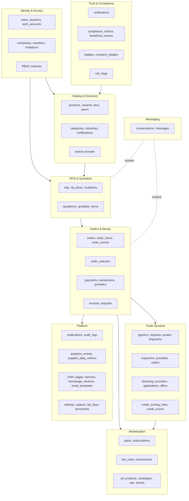
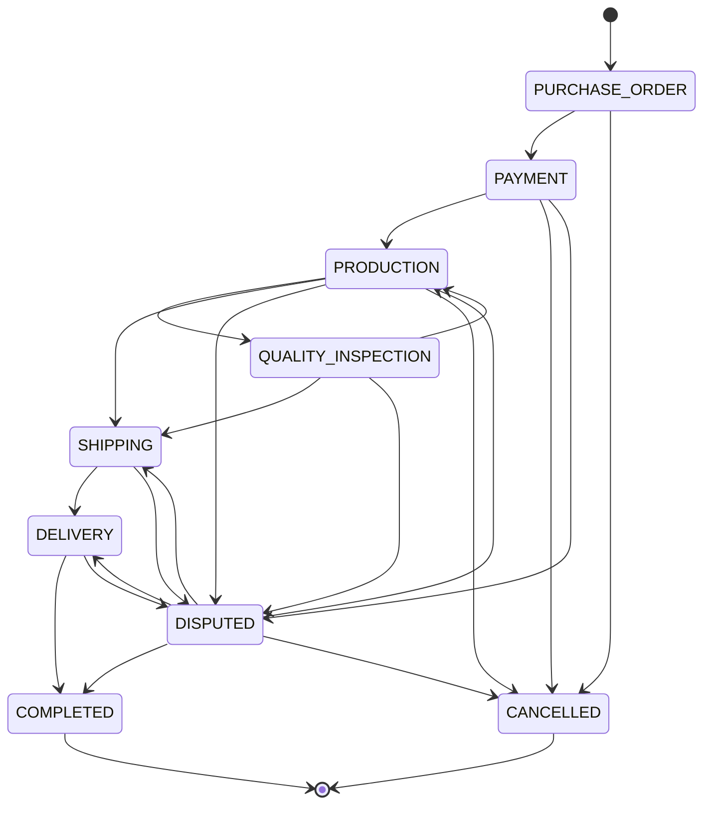

# 01 — Product Architecture

## 1. Product pillars

CANG is not a directory with a checkout bolted on. It is a trade orchestration system whose value compounds
across six pillars, each of which feeds the next.

| # | Pillar | What it delivers | Why it exists |
|---|---|---|---|
| 1 | **Discovery** | Manufacturer directory, product catalog, faceted full-text search, category and industrial-cluster landing pages | International buyers cannot evaluate Vietnamese capacity today; discovery is the top of every funnel and the entire SEO surface |
| 2 | **Demand capture** | RFQ marketplace, supplier auto-matching, quotation comparison, negotiation, contextual messaging | B2B industrial trade is quote-driven, not cart-driven. The RFQ is the real conversion event |
| 3 | **Trust** | KYB/verification workflow, rule-driven badges, verified-purchase reviews, sanctions/UBO screening, risk flags | Cross-border buyers pay a trust premium; the platform's job is to make Vietnamese suppliers legible and accountable |
| 4 | **Transaction** | Configurable order lifecycle, documents, payment orchestration, Trade Assurance, invoices, disputes | Without owning the transaction there is no commission, no data and no defensibility |
| 5 | **Trade services** | Financing marketplace, logistics marketplace and shipment tracking, quality inspection | These are the actual friction points of an export order; each is a revenue stream and a retention hook |
| 6 | **Monetization** | Plans, commissions, orchestration fees, origination fees, service commissions, advertising, RFQ priority, verification fees, API | Multiple independent revenue streams, all configurable from Admin |

### Seller segments

`companies.businessType` (enum) covers every segment in scope: `MANUFACTURER`, `OEM_MANUFACTURER`,
`ODM_MANUFACTURER`, `WHOLESALER`, `EXPORTER`, `DISTRIBUTOR`, `INDUSTRIAL_SUPPLIER`, `SERVICE_PROVIDER`,
`TRADING_COMPANY`, plus buy-side and partner types (`IMPORTER`, `RETAILER`, `BRAND_OWNER`,
`LOGISTICS_PROVIDER`, `INSPECTION_AGENCY`, `FINANCIAL_INSTITUTION`, `OTHER`). Seller/buyer capability is
orthogonal to business type: `companies.isSeller` and `companies.isBuyer` are independent booleans, so a
factory that also imports raw materials gets both dashboards from one company record.

### Industry taxonomy

24 industries are seeded (`src/db/seed/data/reference.ts` → `INDUSTRIES`): apparel, textiles, footwear,
furniture, electronics, electrical equipment, machinery, industrial equipment, automotive components,
motorcycle components, plastics, rubber, packaging, construction materials, agriculture, food processing,
household goods, cosmetics, chemicals, tools, spare parts, light industry, medium industry, industrial
services.

The product taxonomy is a separate two-level tree (`product_categories`, self-referencing `parentId` with a
materialised `path` of slash-joined ancestor slugs): 20 top-level categories and 98 children (118 rows seeded
from `CATEGORIES`), each linked to an industry. Search and RFQ matching walk the subtree via `path LIKE`.

### Geography

Buyers are worldwide (40 countries seeded). Supply is Vietnam-first: 28 provinces seeded, of which **8 are
industrial clusters** with landing-page content (headline, description, hero image, key facts, major
industries, SEO fields): Ho Chi Minh City, Binh Duong, Dong Nai, Bac Ninh, Hai Phong, Hanoi, Da Nang, Long An.

### Languages

`en` and `vi` are live. `src/i18n/routing.ts` declares `plannedLocales = ["zh","ko","ja","ru","th","id"]`.
URLs are always locale-prefixed, so adding a locale is: add messages under `src/messages/<locale>/`, add the
code to `locales`, extend the localized DB columns or introduce translation tables. Metadata already emits
`hreflang` alternates for every configured locale plus `x-default`.

---

## 2. Bounded contexts

Each context owns a set of tables and the invariants over them. Contexts talk to each other through service
functions, never by reaching into another context's tables from a page.



### Responsibilities

| Context | Owns | Key invariants |
|---|---|---|
| **Identity & Access** | `users`, `sessions`, `auth_accounts`, `verification_tokens`, `companies`, `company_members`, `company_invitations`, `manufacturer_profiles`, `buyer_profiles`, `company_industries`, `company_certifications`, `company_media` | One active session row per token hash; a user acts for exactly one company at a time (`sessions.activeCompanyId`); creating a company always creates an OWNER membership, the matching profile row and a FREE subscription |
| **Trust & Compliance** | `verifications`, `compliance_checks`, `beneficial_owners`, `risk_flags`, `badges`, `company_badges` | A badge is either RULE-granted by the engine or MANUAL-granted by staff, never both for the same company/badge pair; verification status on `companies` is a projection of the latest reviewed `verifications` row |
| **Catalog & Discovery** | `products`, `product_images`, `product_price_tiers`, `product_variants`, `product_specifications`, `product_certifications`, `saved_items`, `product_categories`, `industries`, `certifications`, `provinces`, `countries`, `currencies` | Only `status = 'ACTIVE'` products with an ACTIVE company are searchable; `searchVector` is generated by PostgreSQL, never written by the app; denormalised counters are maintained by the owning service |
| **RFQ & Quotation** | `rfqs`, `rfq_items`, `rfq_invitations`, `quotations`, `quotation_items` | Publishing an RFQ is the only way it becomes OPEN and matched; `quotationCount` is recomputed by `refreshQuotationCount`; a supplier may see an RFQ only if it is PUBLIC-and-open or it was invited |
| **Messaging** | `conversations`, `conversation_participants`, `messages` | A conversation always carries its context (`GENERAL`/`PRODUCT`/`RFQ`/`QUOTATION`/`ORDER`/`DISPUTE`) and the two company sides; `messages.translations` is reserved for a translation provider |
| **Orders & Money** | `order_statuses`, `orders`, `order_items`, `order_events`, `invoices`, `payment_providers`, `payments`, `payment_transactions`, `disputes`, `dispute_messages` | Status transitions must be allowed by `order_statuses.allowedTransitions` and by `TRANSITION_ACTORS`; every state change writes an `order_events` row; every money movement writes a `payment_transactions` row |
| **Trade Services** | `logistics_providers/requests/quotes`, `shipments`, `shipment_events`, `inspection_providers`, `inspection_orders`, `financing_providers/applications/offers`, `credit_scoring_rules`, `credit_scores` | CANG records and routes; the licensed partner performs. Every provider row carries `adapterCode` and non-secret `apiConfig` |
| **Monetization** | `plans`, `subscriptions`, `fee_rules`, `commissions`, `ad_products`, `ad_campaigns`, `advertisements`, `ad_events` | No fee is computed without a matching `fee_rules` row; every computed fee becomes a `commissions` ledger entry |
| **Platform** | `notifications`, `audit_logs`, `analytics_events`, `supplier_daily_metrics`, `api_keys`, `pages`, `banners`, `homepage_sections`, `email_templates`, `settings`, `support_tickets`, `support_ticket_messages`, `documents` | Audit writes never throw; notifications never throw; `settings` reads fall back to `SETTING_DEFAULTS` |

---

## 3. Module map

`src/modules/*` — server-side domain logic. Present today:

| Module | Files | What it implements | Status |
|---|---|---|---|
| `auth/` | `rbac.ts`, `session.ts`, `current-user.ts`, `actions.ts`, `password.ts`, `google.ts`, `schemas.ts`, `redirects.ts` | Permission matrices and checks; DB-backed sessions with HMAC-hashed tokens and sliding expiry; `getAuth`/`requireAuth`/`requireCompany`/`requireAdmin`; login, register, logout, forgot/reset password, e-mail verification, profile update, company switching; bcrypt hashing; Google OAuth code exchange | **Working** |
| `companies/` | `service.ts` | `createCompanyForUser` (company + OWNER membership + profile row + FREE subscription, transactional), `uniqueCompanySlug`, `enableCapability` | **Working** |
| `rfq/` | `service.ts` | `matchSuppliersForRfq` (category subtree → industry → full-text fallback, ranked by verification/rating/response rate), `publishRfq`, `refreshQuotationCount`, `canSupplierViewRfq`, `categoryOptions`, `supplierSummary` | **Working** |
| `orders/` | `service.ts` | `DEFAULT_ORDER_STATUSES`, `TRANSITION_ACTORS`, `createOrderFromQuotation`, `transitionOrder`, `addOrderNote`, `parseDepositPercent` | **Working** |
| `payments/` | `provider.ts`, `registry.ts`, `service.ts`, `adapters/manual-bank-transfer.ts` | `PaymentProviderAdapter` interface; adapter registry + `chooseProvider`; `createPaymentSchedule`, `initiatePayment`, `confirmPayment`, `releasePayment`, `refundPayment`; one manual bank-transfer adapter | **Working** (one adapter) |
| `fees/` | `engine.ts` | `resolveFeeRule` (specificity + priority), `computeFee` (fixed / percentage / marginal tiers, min/max clamps), `recordCommission`, `previewFee` | **Working** |
| `search/` | `types.ts`, `index.ts`, `postgres.ts` | `SearchProvider` interface; provider factory; PostgreSQL implementation of `searchProducts`, `searchSuppliers`, `suggest` with weighted tsvector ranking and ~20 filters | **Working** |
| `notifications/` | `service.ts`, `email.ts` | `notifyUser`, `notifyCompany`, `unreadCount`; `EmailProvider` interface with a console implementation and a branded HTML layout | **Working** (console e-mail) |
| `storage/` | `index.ts`, `upload.ts` | `StorageProvider` interface, local-disk implementation, MIME allow-list, content sniffing, random keys, size limits, `saveUpload` → `documents` row | **Working** (local disk) |
| `settings/` | `service.ts` | `SETTING_DEFAULTS`, `getSetting` (30s in-process cache), `setSetting`, `getAllSettings` | **Working** |
| `audit/` | `log.ts` | `audit()` — append-only, never throws | **Working** |

Modules the schema and seeds already support but whose service layer is **not yet written**:
`messaging/`, `reviews/`, `logistics/`, `inspection/`, `financing/`, `credit/`, `advertising/`,
`compliance/`, `analytics/`, `cms/`, `badges/`, `support/`. Each has its tables, enums, relations and — where
relevant — seeded providers and rules. See [`07-mvp-boundaries.md`](07-mvp-boundaries.md).

### Module contract

Every module follows the same four-file shape (`docs/CONVENTIONS.md` §2):

```
modules/<context>/
  service.ts    business operations: DB writes, side effects, notifications, audit
  queries.ts    read models for pages (typed selects with relations)
  schemas.ts    zod input schemas shared by server and client forms
  actions.ts    "use server" Server Actions — thin: auth → validate → service → revalidate/redirect
```

Pages never touch the database directly; they call a module's `queries.ts`. Server Actions never contain
business logic; they call `service.ts`.

---

## 4. Monetization engine

Every revenue stream is data. `src/modules/fees/engine.ts` is the single computation path.

### Fee resolution

```
resolveFeeRule(type, { companyId, categorySlug, countryCode, planId })
  → all active fee_rules of that type, within validFrom/validTo
  → filter: rule.planId matches the company's ACTIVE subscription plan (or rule has none)
            rule.categorySlug matches (or none)
            rule.countryCode matches (or none)
  → sort by specificity (plan 4 + category 2 + country 1), then priority DESC
  → first match, or null
```

`computeFee(rule, baseAmount)` supports `FIXED`, `PERCENTAGE`, and `TIERED` with **marginal** tiers
(`[{upTo: 10000, percent: 3}, {upTo: 50000, percent: 2.5}, {upTo: null, percent: 2}]` charges 3 % on the first
10 000, 2.5 % on the next 40 000, 2 % above), then clamps to `minFee`/`maxFee` and rounds to four decimals.

`recordCommission(type, ctx)` resolves, computes and inserts a `commissions` row
(`PENDING → INVOICED → COLLECTED | WAIVED | REFUNDED`). `previewFee` does the same without writing, for
quotation and checkout screens.

### Revenue streams (seeded defaults)

| Stream | `feeTypeEnum` | Seeded rule | Status |
|---|---|---|---|
| Transaction commission | `TRANSACTION_COMMISSION` | `COMMISSION_DEFAULT` tiered 3 % / 2.5 % / 2 %; category overrides `COMMISSION_FURNITURE` 2.5 %, `COMMISSION_AGRI` 1.5 % | **Wired** — charged in `confirmPayment` |
| Payment orchestration | `PAYMENT_ORCHESTRATION` | 0.8 %, min 5 USD | **Wired** — charged in `confirmPayment` |
| Financing origination | `FINANCING_ORIGINATION` | 1 %, max 5 000 USD | Planned (Phase 3) |
| Logistics commission | `LOGISTICS_COMMISSION` | 5 % of booked quote | Planned (Phase 3) |
| Inspection commission | `INSPECTION_COMMISSION` | 10 % of inspection fee | Planned (Phase 3) |
| Verification fee | `VERIFICATION_FEE` | 199 USD fixed, waived on Pro/Premium | Planned (Phase 2) |
| Advertising | `ADVERTISING` | via `ad_products` pricing, not `fee_rules` | Planned (Phase 4) |
| RFQ priority | `RFQ_PRIORITY` | 29 USD/month for Free sellers | Planned (Phase 4) |
| API access | `API_ACCESS` | 149 USD/month for non-Premium | Planned (Phase 4) |
| Subscription | `SUBSCRIPTION` | plan prices on `plans` | **Partly** — plans seeded, subscription created on signup; billing not implemented |

### Plans

Four seeded plans; `plans.limits` is a typed JSON object (`PlanLimits`) so the enforcement code is one shape.

| Code | Price/mo | maxProducts | RFQ responses/mo | Analytics | rfqPriority | searchBoost | Verification | Seats | API | Featured slots |
|---|---|---|---|---|---|---|---|---|---|---|
| FREE | 0 | 20 | 10 | basic | no | 0 | no | 2 | no | 0 |
| PRO | 99 | 200 | 100 | advanced | yes | 2 | yes | 5 | no | 2 |
| PREMIUM | 349 | ∞ | ∞ | advanced | yes | 5 | yes | ∞ | yes | 6 |
| ENTERPRISE (private) | custom | ∞ | ∞ | advanced | yes | 8 | yes | ∞ | yes | 12 |

`searchBoost` is additive in the ranking formula (`c.search_boost * 0.25` for products,
`c.search_boost * 0.5` for suppliers), so plan tier influences visibility without replacing relevance.

### Advertising

`ad_products` (6 seeded) define placement and pricing model; `ad_campaigns` hold budget, schedule and
targeting; `advertisements` are the individual creatives bound to a product, supplier, category or keyword;
`ad_events` record `IMPRESSION | CLICK | LEAD | RFQ | ORDER` with a per-event cost. Denormalised counters on
`advertisements` give the supplier-facing funnel: impressions → clicks → leads → RFQs → orders → conversion →
spend.

| Ad product | Placement | Pricing | Price | Min budget | Slots |
|---|---|---|---|---|---|
| Featured Product | `FEATURED_PRODUCT` | FLAT_DAILY | 8 | 56 | 24 |
| Featured Supplier | `FEATURED_SUPPLIER` | FLAT_DAILY | 15 | 105 | 12 |
| Top Search | `TOP_SEARCH` | CPC | 0.45 | 50 | ∞ |
| Category Promotion | `CATEGORY_PROMOTION` | FLAT_MONTHLY | 240 | 240 | 6 |
| Homepage Promotion | `HOMEPAGE_PROMOTION` | FLAT_MONTHLY | 900 | 900 | 4 |
| RFQ Boost | `RFQ_BOOST` | CPM | 12 | 30 | ∞ |

---

## 5. Trust & verification design

Trust is the product. It is assembled from four independent signals so that no single one can be gamed.

### 5.1 Verification workflow

`verifications` rows are typed submissions reviewed by staff:
`KYB`, `BUSINESS_LICENSE`, `TAX_REGISTRATION`, `FACTORY_AUDIT`, `EXPORT_LICENSE`, `BANK_ACCOUNT`, `UBO`,
`IDENTITY`. Each carries `data` (the submitted form as JSONB), linked `documents`, reviewer notes, a
`rejectionReason`, `reviewedById`, `reviewedAt` and an `expiresAt` (verifications age out).

Status flows `PENDING → IN_REVIEW → VERIFIED | REJECTED`, and `VERIFIED → EXPIRED` on expiry.
`companies.verificationStatus` and `companies.kybStatus` are projections of the reviewed rows so that listing
queries stay cheap.

### 5.2 Compliance screening

`compliance_checks` records each run of `KYC`, `KYB`, `AML`, `SANCTIONS`, `PEP`, `UBO`, `ADVERSE_MEDIA` or
`TRANSACTION_MONITORING` with the `provider` used (`manual` or a screening vendor), a `status`
(`PENDING | CLEARED | FLAGGED | REJECTED | MANUAL_REVIEW`), the raw `result`, a `riskScore` and a
`nextReviewAt` for periodic re-screening. `beneficial_owners` holds UBO declarations with ownership
percentage, PEP flag, per-person sanctions status and an ID document reference. `companies.sanctionsStatus`
mirrors the latest screen.

### 5.3 Badges — rules as data

`badges` rows carry `ruleConfig` (JSONB) and `isAutomatic`. A nightly badge engine evaluates automatic badges
and writes `company_badges` rows with `source = 'RULE'`; staff can grant the same badges manually with
`source = 'MANUAL'`, an optional `expiresAt` and a `note`. The engine itself is **planned** (Phase 2); the
rules are already seeded and consumed by search (`badgeCodes` filter).

| Badge | Rule type | Seeded `ruleConfig` | Meaning |
|---|---|---|---|
| `VERIFIED_MANUFACTURER` | `VERIFICATION` | `{ verificationStatus: "VERIFIED", requiresManufacturerProfile: true }` | Business registration, tax ID and factory ownership verified |
| `FACTORY_AUDITED` | `VERIFICATION_TYPE` | `{ verificationType: "FACTORY_AUDIT", maxAgeMonths: 24 }` | On-site audit completed in the last 24 months |
| `EXPORT_READY` | `EXPORT` | `{ minExportCountries: 3, requiresIncoterms: true }` | Documented export experience to ≥3 countries and accepted Incoterms |
| `FAST_RESPONSE` | `RESPONSE` | `{ minResponseRate: 90, maxAvgResponseHours: 24, windowDays: 90 }` | ≥90 % of inquiries answered within 24 h over a rolling 90 days |
| `TOP_SUPPLIER` | `PERFORMANCE` | `{ minRating: 4.7, minReviews: 10, maxOpenDisputes: 0 }` | Rating ≥4.7 with ≥10 verified reviews and no unresolved disputes |

Adding a badge is an Admin action plus a rule-type handler in the engine — no schema change.

### 5.4 Reviews

`reviews` scores five dimensions as integers (quality, communication, delivery, accuracy, service) plus a
computed `ratingOverall`. `isVerifiedPurchase` is set when the review is bound to a COMPLETED order;
`settings["reviews.requireVerifiedPurchase"]` (default `true`) makes that mandatory. A unique index on
`(orderId, authorCompanyId)` allows exactly one review per order per side.

Anti-fraud: `fraudScore` (0–100) and `fraudSignals` (JSONB) are computed at submission;
`settings["reviews.autoPublishThreshold"]` (default 30) auto-publishes below the threshold and routes the rest
to `PENDING` moderation. Suppliers may post one `reply`. Moderators can move a review to
`HIDDEN | FLAGGED | REMOVED` with a `moderationNote`. Publishing a review updates `companies.ratingAvg` and
`ratingCount`.

### 5.5 Risk flags

`risk_flags` is the generic tripwire table: any rule (`ruleCode`) can flag any entity
(`entityType` + `entityId`) at a `severity` with a `description` and structured `data`, then be worked through
`OPEN → INVESTIGATING → RESOLVED | DISMISSED`. It backs the Admin fraud/AML queue.

---

## 6. Configurable order lifecycle

The lifecycle is a table, not an enum, because operators will need to add stages (sampling, pre-production
approval, customs hold) without a deploy.

`order_statuses` columns: `code` (PK), `name`, `nameVi`, `description`, `sortOrder`, `color`, `isTerminal`,
`isCancellable`, `allowedTransitions` (text[] of status codes), `isActive`.

`orders.statusCode` references it. The default lifecycle seeded from `DEFAULT_ORDER_STATUSES`:



| Code | Label | Colour | Terminal | Cancellable | Allowed transitions |
|---|---|---|---|---|---|
| `PURCHASE_ORDER` | Purchase order | steel | no | yes | PAYMENT, CANCELLED |
| `PAYMENT` | Awaiting payment | warning | no | yes | PRODUCTION, CANCELLED, DISPUTED |
| `PRODUCTION` | In production | info | no | yes | QUALITY_INSPECTION, SHIPPING, DISPUTED, CANCELLED |
| `QUALITY_INSPECTION` | Quality inspection | info | no | yes | SHIPPING, PRODUCTION, DISPUTED |
| `SHIPPING` | Shipping | brass | no | yes | DELIVERY, DISPUTED |
| `DELIVERY` | Delivered | success | no | yes | COMPLETED, DISPUTED |
| `COMPLETED` | Completed | success | **yes** | no | — |
| `DISPUTED` | In dispute | danger | no | **no** | PRODUCTION, SHIPPING, DELIVERY, COMPLETED, CANCELLED |
| `CANCELLED` | Cancelled | steel | **yes** | no | — |

**Actor rules** (`TRANSITION_ACTORS` in `src/modules/orders/service.ts`) constrain *who* may make a legal
transition. Admin bypasses both checks (and the bypass is audited).

| Target status | Who may trigger it |
|---|---|
| `PAYMENT` | SUPPLIER (supplier confirms the PO, opening the payment window) |
| `PRODUCTION` | SUPPLIER |
| `QUALITY_INSPECTION` | SUPPLIER, BUYER |
| `SHIPPING` | SUPPLIER |
| `DELIVERY` | BUYER, SUPPLIER |
| `COMPLETED` | BUYER (only the buyer closes an order) |
| `DISPUTED` | BUYER, SUPPLIER |
| `CANCELLED` | BUYER, SUPPLIER (subject to `isCancellable`) |

`transitionOrder` runs in a transaction: validate target exists and is active → check `allowedTransitions` →
check actor → stamp the matching timestamp (`confirmedAt`, `shippedAt`, `deliveredAt`, `completedAt`,
`cancelledAt`) → update → insert an `order_events` STATUS_CHANGE row. After commit it notifies both companies
and writes an audit record.

The RFQ→Quotation→Negotiation prefix of the specified lifecycle lives in the RFQ context (`rfqs.status`,
`quotations.status`) and converges at `createOrderFromQuotation`, which is why `order_statuses` starts at
`PURCHASE_ORDER`. The Admin lifecycle editor can add earlier stages if the business wants them materialised on
the order itself.

### Order timeline and documents

`order_events` is the audit-grade timeline: `type` (`STATUS_CHANGE | PAYMENT | SHIPMENT | DOCUMENT | NOTE |
INSPECTION | DISPUTE | SYSTEM`), `fromStatus`/`toStatus`, `title`, `description`, structured `data`, `actorId`
and independent `isVisibleToBuyer` / `isVisibleToSupplier` flags so staff can record internal events.

Documents attach through the central `documents` registry, typed by `documentTypeEnum`: quotation, purchase
order, proforma invoice, commercial invoice, packing list, bill of lading, airway bill, certificate of origin,
certificate, inspection report, contract, business licence, tax certificate, export licence, ID document, bank
statement, financial statement, specification, drawing, photo, video, other. Visibility is
`PRIVATE | COMPANY | COUNTERPARTY | ADMIN | PUBLIC`.

---

## 7. Phasing

| Phase | Scope | Current state |
|---|---|---|
| **Phase 1 — Marketplace** | Company profiles, manufacturer profiles, product catalog with variants/tiers/specs, search and filters, RFQ marketplace with quotation comparison, messaging, buyer/seller/admin accounts, admin console, SEO surface (categories, clusters, guides, structured data, sitemap) | Data layer, search, RFQ service, auth/RBAC, admin scaffolding **done**; public pages and dashboard pages **to build** |
| **Phase 2 — Transactions** | Orders and lifecycle, payment orchestration, Trade Assurance, invoices, disputes, reviews, supplier verification and badges | Order and payment services **done** with one manual adapter; verification, badge engine, reviews and dispute workflow **foundation only** |
| **Phase 3 — Trade services** | Logistics marketplace and shipment tracking, quality inspection, financing marketplace, credit scoring | Schema, enums, seeded providers and scoring rules **done**; services and UI **not started** |
| **Phase 4 — Scale** | Advertising marketplace, advanced analytics and rollups, public API with keys and scopes, additional locales and international expansion | Schema and seeds **done**; everything else **not started** |

The phases are cumulative, but the schema is not phased: all 83 tables exist from migration `0001_init`, so a
Phase 3 feature needs a service and a UI, never a migration on live financial tables.
