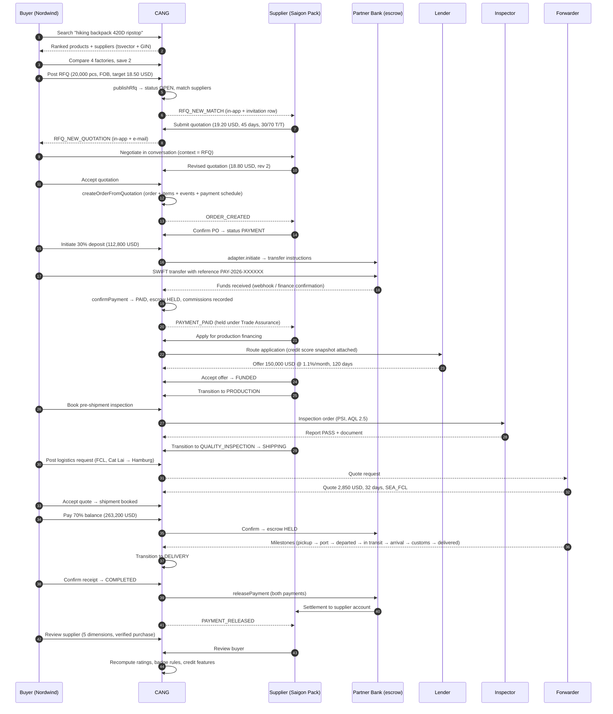
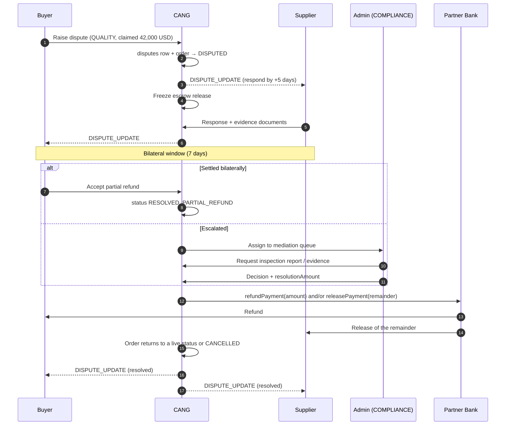

# 03 — User Journeys

Nine journeys, each written as the sequence of *system* actions: which tables change, which notifications
fire, which fees apply, what happens to escrow. Where a step is not implemented yet it is marked
**[planned P*n*]** so the document can be used as a build specification.

Terminology is consistent with [`00-overview.md`](00-overview.md) §4.

---

## A. Flagship journey — 20,000 backpacks, Hamburg to Ho Chi Minh City and back

**Actors.** Lena Hartmann, procurement lead at *Nordwind Outdoor GmbH* (Hamburg, DE) — buyer.
*Saigon Pack Manufacturing* (Ho Chi Minh City, VN) — supplier, `MANUFACTURER`, Pro plan.
CANG platform. Partner Bank (Trade Assurance account). Vietnam Trade Bank (lender). Saigon Freight Solutions
(forwarder). Vietnam Quality Control Services (inspection).

### A.1 Sequence

### A.2 Step by step

| # | Step | Tables written | Notifications | Fees | Escrow state |
|---|---|---|---|---|---|
| 1 | Lena searches `hiking backpack 420D`. `searchProducts({ q, categorySlug: "bags-luggage", countryCode: "VN" })` builds a prefix tsquery (`hiking:* & backpack:* & 420d:*`) and ranks `ts_rank_cd(products.search_vector)*10 + ts_rank_cd(companies.search_vector)*2 + searchBoost + featured + verified` | `analytics_events` (`SEARCH`) **[planned P4]** | — | — | — |
| 2 | Opens two supplier profiles and four products. `products.viewCount` and `companies.viewCount` increment | `products`, `companies`, `analytics_events` (`PRODUCT_VIEW`, `SUPPLIER_VIEW`) | — | — | — |
| 3 | Saves two suppliers and three products | `saved_items` | — | — | — |
| 4 | Posts an RFQ: 20 000 pcs, unit `pieces`, target 18.50 USD, destination DE/Hamburg, Incoterm `FOB`, quote deadline +14 days, certification requirement `BSCI + OEKO_TEX`, sample required | `rfqs` (DRAFT, `rfqNumber = RFQ-2026-XXXXXX`), `rfq_items` | — | — | — |
| 5 | Publishes. `publishRfq` sets `OPEN`, `publishedAt`, `expiresAt` (deadline or `settings["rfq.defaultValidityDays"]` = 14). `matchSuppliersForRfq` selects ACTIVE sellers that either have ACTIVE products in the category subtree, or share the category's industry, or match the RFQ title in `companies.search_vector`; ranked `verified*2 + rating*0.5 + responseRate/100`, limited by `settings["rfq.autoMatchLimit"]` = 30 | `rfqs`, `rfq_invitations` (one per match), `audit_logs` (`rfq.publish`) | `RFQ_NEW_MATCH` in-app to every matched supplier (e-mail suppressed for volume) | — | — |
| 6 | Saigon Pack opens the RFQ. `canSupplierViewRfq` allows it (PUBLIC + OPEN) | `rfq_invitations.status = VIEWED`, `viewedAt`; `rfqs.viewCount` | — | — | — |
| 7 | Submits a quotation: 20 000 × 19.20 = 384 000 USD subtotal, shipping 0 (FOB), lead time 45 days, `paymentTerms = "30% deposit, 70% before shipment"`, validity 14 days, sample 45 USD | `quotations` (SUBMITTED, `QUO-2026-XXXXXX`), `quotation_items`; `refreshQuotationCount` updates `rfqs.quotationCount` | `RFQ_NEW_QUOTATION` in-app + e-mail to the buyer company | — | — |
| 8 | Two more suppliers quote. Lena compares on `/buyer/rfqs/[id]/compare` and records private `buyerNotes` per quotation | `quotations.buyerNotes` | — | — | — |
| 9 | Negotiation in a conversation with `context = RFQ`, `rfqId` set. Counter-offers are `messages` of type `COUNTER_OFFER` with a structured `payload` **[planned P1]** | `conversations`, `conversation_participants`, `messages` | `MESSAGE_NEW` | — | — |
| 10 | Saigon Pack revises: 18.80 USD → 376 000 USD. New row with `revisionNumber = 2`, `parentQuotationId` = rev 1; rev 1 → `REVISED` | `quotations` | `QUOTATION_REVISED` | — | — |
| 11 | Lena accepts. `createOrderFromQuotation` runs one transaction: insert `orders` (`ORD-2026-XXXXXX`, `statusCode = PURCHASE_ORDER`, subtotal/total copied, `incoterm = FOB`, `paymentTerms`, `depositPercent = 30` parsed from the terms, `tradeAssuranceEnabled` from `settings["tradeAssurance.enabled"]`, `tradeAssuranceTerms` snapshot with `inspectionWindowDays = 7` and `fundsHeldBy: "licensed payment partner"`, `expectedProductionDays = 45`, `expectedShipDate`, `placedAt`); copy `quotation_items` → `order_items`; quotation → `ACCEPTED`; RFQ → `AWARDED` with `awardedQuotationId` and `closedAt`; insert the first `order_events` row; `createPaymentSchedule` | `orders`, `order_items`, `quotations`, `rfqs`, `order_events`, `payments`, `audit_logs` (`order.create`) | `ORDER_CREATED` in-app + e-mail to the supplier | — | Both payments created with `escrowStatus = PENDING_FUNDING` |
| 12 | `createPaymentSchedule` picks an escrow-capable provider via `chooseProvider({ currency: "USD", escrow: true })` → `PARTNER_BANK_TA`, and writes two `payments`: `DEPOSIT` 112 800 USD due +7 days, `BALANCE` 263 200 USD due on `expectedShipDate` | `payments` ×2 | — | — | `PENDING_FUNDING` |
| 13 | Saigon Pack confirms the PO: `transitionOrder(PURCHASE_ORDER → PAYMENT, actorSide: SUPPLIER)`. Allowed by `allowedTransitions` and `TRANSITION_ACTORS.PAYMENT = ["SUPPLIER"]`. Stamps `confirmedAt` | `orders`, `order_events`, `audit_logs` (`order.transition`) | `ORDER_STATUS` to both companies | — | `PENDING_FUNDING` |
| 14 | Lena initiates the deposit. `initiatePayment` calls `ManualBankTransferAdapter.initiate` → beneficiary, bank, account, SWIFT, amount, reference `PAY-2026-XXXXXX`. Payment → `PENDING`; provider `feeConfig` (0.6 %) computes `feeAmount = 676.80`, `netAmount = 112 123.20` | `payments`, `payment_transactions` (`CHARGE`/`PENDING`), `order_events` (`PAYMENT`), `audit_logs` (`payment.initiate`) | — | Provider fee recorded on the payment | `PENDING_FUNDING` |
| 15 | Wire arrives at the partner bank. Finance staff (or a webhook, **[planned P2]**) calls `confirmPayment`: payment → `PAID`, `paidAt`, `escrowStatus = HELD`; `payment_transactions` `CAPTURE`/`SUCCEEDED`; then **two commissions** via `recordCommission` on the seller: `TRANSACTION_COMMISSION` (tiered: 3 % of the first 10 000 + 2.5 % of the next 40 000 + 2 % of the remaining 62 800 = 300 + 1 000 + 1 256 = **2 556 USD**) and `PAYMENT_ORCHESTRATION` (0.8 % = **902.40 USD**, above the 5 USD minimum) | `payments`, `payment_transactions`, `commissions` ×2, `order_events`, `audit_logs` (`payment.confirm`) | `PAYMENT_PAID` to both companies, supplier copy flagged "held under Trade Assurance" | 2 556.00 + 902.40 USD, status `PENDING` | **`HELD`** |
| 16 | Saigon Pack needs working capital. Applies for `PRODUCTION_FINANCING`, 150 000 USD, 120 days, linked to the order. `credit_scores` snapshot computed from `credit_scoring_rules` (transaction history, GMV 12m, dispute rate, company age, verification level, payment behaviour, delivery performance) **[planned P3]** | `financing_applications` (`FIN-2026-XXXXXX`, `SUBMITTED` → `ROUTED`), `credit_scores` | `FINANCING_UPDATE` | — | unchanged |
| 17 | Routing matches `VN_TRADE_BANK` (`routingRules.minCreditScore = 55`, `side = SELLER`, products include `PRODUCTION_FINANCING`, currency USD, amount within 10 000–2 000 000). Lender returns an offer 1.1 %/month, 120 days **[planned P3]** | `financing_offers` (`OFFERED`), `financing_applications.status = OFFERED` | `FINANCING_UPDATE` | On funding: `FINANCING_ORIGINATION` 1 % capped at 5 000 → **1 500 USD** | unchanged |
| 18 | Supplier accepts; lender funds. Application → `ACCEPTED` → `FUNDED` with `fundedAt` | `financing_offers`, `financing_applications`, `commissions` | `FINANCING_UPDATE` | 1 500 USD | unchanged |
| 19 | `transitionOrder(PAYMENT → PRODUCTION, SUPPLIER)` | `orders`, `order_events` | `ORDER_STATUS` ×2 | — | `HELD` |
| 20 | Lena books a pre-shipment inspection (`PRE_SHIPMENT`, AQL 2.5) with `VQC_INSPECT` **[planned P3]** | `inspection_orders` (`INS-2026-XXXXXX`, `REQUESTED` → `QUOTED` → `SCHEDULED`) | `INSPECTION_UPDATE` | On completion: `INSPECTION_COMMISSION` 10 % of the inspection fee | `HELD` |
| 21 | Inspector completes: `result = PASS`, checklist JSON, findings, report uploaded to `documents` (`INSPECTION_REPORT`) linked to the order | `inspection_orders`, `documents`, `order_events` (`INSPECTION`) | `INSPECTION_UPDATE` | commission row | `HELD` |
| 22 | `PRODUCTION → QUALITY_INSPECTION → SHIPPING` (supplier) | `orders`, `order_events` ×2 | `ORDER_STATUS` ×4 | — | `HELD` |
| 23 | Before shipment, Lena pays the 70 % balance — same `initiatePayment` / `confirmPayment` path. Commission on 263 200 (tiers apply per payment, since `recordCommission` is called with the payment amount): 300 + 1 000 + 2 % of the remaining 213 200 = 4 264 → **5 564 USD**; orchestration 0.8 % → **2 105.60 USD** | `payments`, `payment_transactions`, `commissions` ×2, `order_events` | `PAYMENT_PAID` ×2 | 7 669.60 USD | second payment **`HELD`** |
| 24 | Logistics request: FCL 40HQ, Cat Lai → Hamburg, ready date, cargo value 376 000 USD, insurance required **[planned P3]** | `logistics_requests` (`LOG-2026-XXXXXX`, `OPEN`) | — | — | `HELD` |
| 25 | Three forwarders quote; Lena accepts Saigon Freight at 2 850 USD / 32 days | `logistics_quotes` (accepted one → `ACCEPTED`, others → `REJECTED`), `logistics_requests.status = BOOKED` | `SHIPMENT_UPDATE` | `LOGISTICS_COMMISSION` 5 % = **142.50 USD** | `HELD` |
| 26 | Shipment created with carrier, container, vessel, ETD/ETA, insurance | `shipments` (`SHP-2026-XXXXXX`, `BOOKED`) | `SHIPMENT_UPDATE` | — | `HELD` |
| 27 | Milestones arrive by webhook or manual entry: `PICKED_UP → AT_ORIGIN_PORT → DEPARTED → IN_TRANSIT → AT_DESTINATION_PORT → CUSTOMS_CLEARANCE → OUT_FOR_DELIVERY → DELIVERED` | `shipment_events` (one per milestone), `shipments.status`, `order_events` (`SHIPMENT`) | `SHIPMENT_UPDATE` per milestone | — | `HELD` |
| 28 | Goods arrive in Hamburg. `transitionOrder(SHIPPING → DELIVERY)` stamps `deliveredAt`. The `tradeAssuranceTerms.inspectionWindowDays = 7` clock starts | `orders`, `order_events` | `ORDER_STATUS` ×2 | — | `HELD` |
| 29 | Lena confirms acceptance: `transitionOrder(DELIVERY → COMPLETED, BUYER)` stamps `completedAt`. (If she does nothing, a scheduled job auto-completes after the inspection window **[planned P2]**) | `orders`, `order_events` | `ORDER_STATUS` ×2 | — | `HELD` |
| 30 | `releasePayment` on both payments: `escrowStatus = RELEASED`, `status = SETTLED`, `releasedAt`, `settledAt`; `payment_transactions` `RELEASE`/`SUCCEEDED` for `netAmount` | `payments` ×2, `payment_transactions` ×2, `order_events` ×2, `audit_logs` (`payment.release`) | `PAYMENT_RELEASED` to the supplier | Commissions move `PENDING → INVOICED` on the next billing run **[planned P2]** | **`RELEASED`** |
| 31 | Supplier repays the lender from the settlement; application → `REPAYING` → `REPAID` **[planned P3]** | `financing_applications` | `FINANCING_UPDATE` | — | — |
| 32 | Both sides review. Buyer rates quality/communication/delivery/accuracy/service; `isVerifiedPurchase = true` (bound to a COMPLETED order); `fraudScore` computed; below `settings["reviews.autoPublishThreshold"]` = 30 it publishes immediately | `reviews` ×2, `companies.ratingAvg` / `ratingCount` | `REVIEW_RECEIVED` | — | — |
| 33 | Nightly jobs recompute badges (`TOP_SUPPLIER` now qualifies if rating ≥4.7 with ≥10 reviews and no open disputes), refresh `credit_scores`, and roll up `supplier_daily_metrics` **[planned P2/P3]** | `company_badges`, `credit_scores`, `supplier_daily_metrics` | — | — | — |

**Platform revenue from this one order:** 2 556 + 902.40 + 5 564 + 2 105.60 = **11 128 USD** in commission and
orchestration fees, plus 1 500 USD financing origination, 142.50 USD logistics commission and the inspection
referral — against an order value of 376 000 USD (≈3.4 % blended take rate), all derived from `fee_rules` rows
that an operator can change without a deploy. (Because tiers are applied per payment rather than per order,
the 30/70 split passes through the two higher-rate tiers twice: 2 556 + 5 564 = 8 120 USD, versus 7 820 USD
had the 376 000 been paid in one transfer. Whether commission should be tiered per order instead is an open
product decision — [`07-mvp-boundaries.md`](07-mvp-boundaries.md) L-13.)

---

## B. Supplier onboarding → verification → first product → first RFQ response → fulfilment → settlement

| # | Step | System actions |
|---|---|---|
| 1 | Register at `/register?type=seller` with name, e-mail, company name, password, terms | Rate limit `register` (5/hour/IP). `users` row (`status = ACTIVE`, `platformRole = USER`), `verification_tokens` (`EMAIL_VERIFICATION`), `createCompanyForUser` → `companies` (unique slug, `isSeller = true`, `businessType = MANUFACTURER`) + `company_members` (OWNER, primary) + `manufacturer_profiles` + FREE `subscriptions`. `createSession` sets the `cang_session` cookie with an HMAC-hashed token. Verification e-mail sent through the `EmailProvider` |
| 2 | Verify e-mail | `verificationTokens.consumedAt`, `users.emailVerifiedAt` |
| 3 | Complete company profile at `/seller/company` **[P1]** | `companies` (description, tagline, logo, cover, year established, employee range, languages, SEO), `company_media`, `company_industries` |
| 4 | Complete factory profile at `/seller/company/factory` **[P1]** | `manufacturer_profiles`: factory address, size m², production lines, annual capacity, OEM/ODM/private-label flags, min order value, avg and sample lead times, export countries, main markets, export %, R&D and QC staff, equipment, materials, accepted payment terms and Incoterms, video URLs, factory-tour flag |
| 5 | Upload certifications **[P1]** | `/api/uploads` → `documents` (`CERTIFICATE`); `company_certifications` (certificate number, issued/expiry, `status = PENDING`) |
| 6 | Submit KYB at `/seller/company/verification` **[P2]** | `verifications` (`type = KYB`, `PENDING`) with business licence, tax registration and UBO documents; `beneficial_owners` rows; `compliance_checks` (`SANCTIONS`, `KYB`) queued when `settings["compliance.sanctionsScreeningEnabled"]` is on |
| 7 | Admin reviews (journey D) | `verifications.status = VERIFIED`, `companies.verificationStatus = VERIFIED`, `kybStatus = VERIFIED`, `verifiedAt`; `VERIFICATION_STATUS` notification; badge engine grants `VERIFIED_MANUFACTURER` |
| 8 | Create the first product **[P1]** | `products` (DRAFT → `PENDING_REVIEW` if `settings["products.requireModeration"]`, else `ACTIVE` with `publishedAt`), `product_images`, `product_price_tiers`, `product_variants`, `product_specifications`, `product_certifications`. PostgreSQL regenerates `search_vector`; plan limit `maxProducts` enforced against the active subscription |
| 9 | Receive a matched RFQ | `rfq_invitations` row + `RFQ_NEW_MATCH` notification (see A.5) |
| 10 | Submit a quotation **[P1]** | `quotations` + `quotation_items`; `refreshQuotationCount`; free-plan `maxRfqResponsesPerMonth` checked |
| 11 | Win, fulfil, ship | Journey A steps 11–28 from the supplier side |
| 12 | Settlement | `releasePayment` → `escrowStatus = RELEASED`, `status = SETTLED`; partner bank pays out `netAmount`; `commissions` invoiced separately |
| 13 | Reputation compounds | `reviews` → `companies.ratingAvg`/`ratingCount`; `transactionCount` and `transactionVolumeUsd` increment; badge engine re-evaluates `FAST_RESPONSE` and `TOP_SUPPLIER`; `credit_scores` improve, unlocking better financing terms |

---

## C. Buyer onboarding

| # | Step | System actions |
|---|---|---|
| 1 | Browse anonymously; search, category and supplier pages are public | `analytics_events` (`PAGE_VIEW`, `SEARCH`, `PRODUCT_VIEW`) **[P4]** |
| 2 | Hit a gate — "Contact supplier", "Request quotation" or "Save" — and register at `/register?type=buyer` with the intent preserved in `?next=` | `users`, `verification_tokens`, `createCompanyForUser` (`isBuyer = true`, `businessType = IMPORTER`, `buyer_profiles` with `destinationCountries = [countryCode]`), FREE subscription, session |
| 3 | Or sign in with Google | `/api/auth/google` → state cookie → callback exchanges the code, upserts `auth_accounts` (`GOOGLE`), creates or matches the user by e-mail, creates a session. Users without a company land on `/onboarding` |
| 4 | Onboarding | `onboardingAction` creates the company, or `enableCapabilityAction` adds the missing buyer/seller capability to an existing one |
| 5 | Complete the buyer profile **[P1]** | `buyer_profiles`: sourcing categories, annual purchasing volume, preferred currency, destination countries, preferred Incoterms |
| 6 | Optional KYB | Required for orders only when `settings["compliance.kybRequiredForOrders"]` is true (default false, so first-order friction stays low) |
| 7 | First action | Post an RFQ, contact a supplier, or save items — each writes its own aggregate and notifies the supplier side |

---

## D. Admin verification / KYB review

| # | Step | System actions |
|---|---|---|
| 1 | Supplier submits; the row lands in the queue | `verifications` (`PENDING`), linked `documents` |
| 2 | Reviewer with `admin.verification.review` (COMPLIANCE, ADMIN or SUPER_ADMIN) opens `/admin/verification/[id]` **[P2]** | Documents served through `/api/files/[...key]`, which allows staff by `isStaff(platformRole)` |
| 3 | Claim for review | `verifications.status = IN_REVIEW` |
| 4 | Cross-checks: business registration number against the national register, tax ID, UBO declarations, sanctions/PEP screening result | `compliance_checks` rows per check type with `provider`, `result`, `riskScore`, `nextReviewAt`; `beneficial_owners.sanctionsStatus` |
| 5a | Approve | `verifications` → `VERIFIED` + `reviewedById` + `reviewedAt` + `expiresAt`; `companies.verificationStatus`/`kybStatus` = `VERIFIED`, `verifiedAt`; `audit_logs` (`admin.company.verify`, `actorType = ADMIN`); `VERIFICATION_STATUS` notification; badge engine grants `VERIFIED_MANUFACTURER` on the next run |
| 5b | Reject | `verifications` → `REJECTED` with `rejectionReason`; notification explains what to resubmit; company keeps `UNVERIFIED` |
| 5c | Escalate | `compliance_checks.status = MANUAL_REVIEW` and/or a `risk_flags` row at `HIGH`/`CRITICAL` |
| 6 | Expiry | A scheduled job moves `VERIFIED` rows past `expiresAt` to `EXPIRED`, downgrades `companies.verificationStatus` and revokes rule-granted badges **[P2]** |

Every admin decision writes an `audit_logs` row with `before`/`after` snapshots. Nothing in the admin console
mutates without an audit entry.

---

## E. Dispute

| # | Step | System actions |
|---|---|---|
| 1 | Buyer raises a dispute within the Trade Assurance window (`tradeAssuranceTerms.inspectionWindowDays`, default 7 days after `deliveredAt`) | `disputes` (`DSP-2026-XXXXXX`, `type = QUALITY`, `status = OPEN`, `claimedAmount`, `respondBy = +5 days`), `documents` (photos, inspection report), `order_events` (`DISPUTE`) |
| 2 | Order moves to `DISPUTED` — allowed from `PAYMENT`, `PRODUCTION`, `QUALITY_INSPECTION`, `SHIPPING` or `DELIVERY`, and `DISPUTED` is `isCancellable = false` so neither side can unilaterally cancel | `orders.statusCode`, `order_events` |
| 3 | Escrow release is blocked: `releasePayment` refuses unless `escrowStatus` is `HELD`/`PARTIALLY_RELEASED`, and the dispute gate prevents the completion path that triggers release **[P2 gate]** | — |
| 4 | Both sides exchange `dispute_messages`; staff notes use `isInternal = true` and are never shown to the parties | `dispute_messages` |
| 5 | No bilateral settlement within the window → `UNDER_REVIEW`, then `MEDIATION` with an assigned mediator holding `admin.disputes.resolve` | `disputes.status` |
| 6 | Mediator weighs the order snapshot, quotation terms, inspection report, shipment milestones and message history | reads only |
| 7a | Full refund → `RESOLVED_REFUND`; `refundPayment(full)` sets `status = REFUNDED`, `escrowStatus = REFUNDED`, writes a `REFUND` transaction; commissions on that payment move to `REFUNDED` | `disputes`, `payments`, `payment_transactions`, `commissions`, `audit_logs` (`payment.refund`) |
| 7b | Partial refund → `RESOLVED_PARTIAL_REFUND` with `resolutionAmount`; refund part, release the remainder (`PARTIALLY_RELEASED` → `RELEASED`) | same |
| 7c | No action → `RESOLVED_NO_ACTION`; funds release normally | `payments` |
| 8 | Order leaves `DISPUTED` for `PRODUCTION`, `SHIPPING`, `DELIVERY`, `COMPLETED` or `CANCELLED` (admin transitions bypass actor rules and are audited) | `orders`, `order_events`, `audit_logs` |
| 9 | Aftermath: dispute rate feeds `credit_scoring_rules.DISPUTE_RATE`; an unresolved dispute blocks `TOP_SUPPLIER` (`maxOpenDisputes: 0`); a pattern of disputes opens a `risk_flags` row | `credit_scores`, `company_badges`, `risk_flags` |

---

## F. Financing application routing

| # | Step | System actions |
|---|---|---|
| 1 | Company opens `/seller/financing` or `/buyer/financing` and picks a product type. Seller side: `WORKING_CAPITAL`, `PRODUCTION_FINANCING`, `INVOICE_FACTORING`, `RECEIVABLES_FINANCING`, `PURCHASE_ORDER_FINANCING`. Buyer side: `INVOICE_FINANCING`, `PURCHASE_FINANCING`, `BNPL`, `IMPORT_FINANCING` | — |
| 2 | Submit amount, currency, tenor, purpose, optional `orderId`, and `financialData` (revenue, receivables, bank/accounting references) | `financing_applications` (`FIN-…`, `DRAFT` → `SUBMITTED`, `submittedAt`), `documents` (financial statements, bank statements) |
| 3 | Credit scoring: features extracted per `credit_scoring_rules` (weights: transaction history 20, order volume 15, dispute rate 15, company age 10, verification 15, payment behaviour 15, delivery performance 10), producing a 0–100 score, a grade and a full `breakdown` array. The snapshot is immutable and versioned | `credit_scores`; `financing_applications.riskScore`, `riskGrade`, `riskScoreVersion`, `riskFactors` |
| 4 | Routing: eligible `financing_providers` are those that are active, list the product type, cover the company's country and currency, have `minAmount ≤ amount ≤ maxAmount`, accept the tenor, and whose `routingRules` are satisfied (`minCreditScore`, `side`, optionally allowed industries). Ordered by `sortOrder` | `financing_applications.status = ROUTED`, `routedAt` |
| 5 | Each provider is contacted through its `adapterCode` (`manual` opens an admin task; an API adapter posts the application) | `financing_applications.providerId` per routed attempt |
| 6 | Offers return: amount, interest rate, fee percent/amount, tenor, repayment schedule, terms, validity | `financing_offers` (`OFFERED`); application → `OFFERED`; `FINANCING_UPDATE` notification |
| 7 | Applicant accepts one offer | `financing_offers.status = ACCEPTED`, `acceptedAt`; `financing_applications.acceptedOfferId`, `status = ACCEPTED`, `decidedAt`; other offers → `REJECTED` |
| 8 | Lender disburses | `status = FUNDED`, `fundedAt`; `recordCommission("FINANCING_ORIGINATION")` → 1 % capped at 5 000 USD |
| 9 | Repayment | `REPAYING` → `REPAID` (`repaidAt`) or `DEFAULTED`; outcome feeds the next `credit_scores` computation |
| 10 | Declines | `status = DECLINED` with `declineReason`; the applicant sees why and what would change the answer |

CANG never underwrites. Every decision is the licensed lender's; the platform stores the application, the
score snapshot that informed it, and the origination fee. **Entire journey is planned (Phase 3)** — schema,
three seeded demo providers and seven scoring rules exist.

---

## G. Logistics quote and shipment tracking

| # | Step | System actions |
|---|---|---|
| 1 | Buyer or supplier creates a request from an order (addresses prefilled from the order) or standalone: services needed (`FACTORY_PICKUP`, `DOMESTIC_TRANSPORT`, `WAREHOUSING`, `FREIGHT_FORWARDING`, `SEA_FREIGHT`, `AIR_FREIGHT`, `RAIL_FREIGHT`, `CUSTOMS_BROKERAGE`, `LAST_MILE`, `CARGO_INSURANCE`), preferred mode, origin/destination, Incoterm, cargo description, HS code, packages, gross weight, volume, container type, cargo value, insurance requirement, ready date, quote deadline | `logistics_requests` (`LOG-…`, `OPEN`) |
| 2 | Matching providers are notified — those whose `services` and `modes` intersect the request and whose `countries` cover origin and destination | — |
| 3 | Providers quote: amount, cost breakdown (JSON array of labelled line items), mode, transit days, validity | `logistics_quotes` (`SUBMITTED`) |
| 4 | Requester compares and accepts one | accepted → `ACCEPTED`, others → `REJECTED`; `logistics_requests.status = BOOKED`; `LOGISTICS_COMMISSION` (5 %) recorded against the provider |
| 5 | Shipment created | `shipments` (`SHP-…`, `BOOKED`, carrier, tracking number, container number, vessel/flight, Incoterm, origin/destination ports and addresses, packages, weight, volume, ETD/ETA, insurance, cost) |
| 6 | Milestones arrive from a carrier webhook, a provider API poll, or manual entry — `source` records which | `shipment_events` (milestone, status, location, description, `occurredAt`); `shipments.status`; `order_events` (`SHIPMENT`); `SHIPMENT_UPDATE` notifications |
| 7 | Milestone chain | `PENDING → BOOKED → PICKED_UP → AT_WAREHOUSE → AT_ORIGIN_PORT → DEPARTED → IN_TRANSIT → AT_DESTINATION_PORT → CUSTOMS_CLEARANCE → OUT_FOR_DELIVERY → DELIVERED`, with `EXCEPTION` and `CANCELLED` as off-ramps |
| 8 | Documents attach as they are issued: bill of lading, airway bill, packing list, certificate of origin, commercial invoice | `documents` linked by `shipmentId` and `orderId` |
| 9 | `DELIVERED` with `deliveredAt` lets the order move to `DELIVERY`, starting the Trade Assurance acceptance window | `shipments`, `orders` |

**Planned (Phase 3)** — schema and three seeded demo forwarders exist.

---

## H. Quality inspection

| # | Step | System actions |
|---|---|---|
| 1 | Buyer (or supplier, to pre-empt a concern) requests an inspection: type `FACTORY_AUDIT`, `PRE_PRODUCTION`, `DURING_PRODUCTION`, `PRE_SHIPMENT` or `CONTAINER_LOADING`; optional `orderId`, factory address, requested date | `inspection_orders` (`INS-…`, `REQUESTED`) |
| 2 | Matching agencies (`inspection_providers` whose `services` include the type and whose `countries` include VN) quote a fee | `inspection_orders.status = QUOTED`, `fee`, `currency`, `providerId` |
| 3 | Requester confirms; the agency schedules | `status = SCHEDULED`, `scheduledAt` |
| 4 | Inspection performed against a checklist (JSON array of `{item, result, note}`) | `status = IN_PROGRESS` |
| 5 | Report filed | `status = COMPLETED`, `completedAt`, `result` ∈ `PASS | FAIL | CONDITIONAL`, `findings`, `reportDocumentId` → `documents` (`INSPECTION_REPORT`); `order_events` (`INSPECTION`); `INSPECTION_UPDATE` notification to both sides |
| 6 | Consequences | `PASS` → order may move `QUALITY_INSPECTION → SHIPPING`. `FAIL` → back to `PRODUCTION` for rework, or a dispute. `CONDITIONAL` → buyer decides. A completed `FACTORY_AUDIT` in the last 24 months satisfies the `FACTORY_AUDITED` badge rule |
| 7 | Monetization | `INSPECTION_COMMISSION` 10 % of the fee, paid by the agency |

**Planned (Phase 3)** — schema and two seeded demo agencies exist.

---

## I. Review and anti-fraud

| # | Step | System actions |
|---|---|---|
| 1 | Order reaches `COMPLETED`. Both sides are invited to review; `settings["reviews.requireVerifiedPurchase"]` (default true) permits reviews only from a completed order | `notifications` |
| 2 | Author rates five dimensions 1–5 (quality, communication, delivery, accuracy, service), optional title and body | `reviews` (`status = PENDING`, `isVerifiedPurchase = true`, `ratingOverall` = mean of the five) |
| 3 | The unique index on `(orderId, authorCompanyId)` allows exactly one review per order per side | DB constraint |
| 4 | Fraud scoring: signals include reciprocal-review timing, author account age, whether buyer and seller share IPs or beneficial owners, review velocity from the same author, order value versus the author's history, text similarity to other reviews, and rating distribution outliers. Result stored in `fraudScore` (0–100) and `fraudSignals` (JSONB) | `reviews` |
| 5 | Below `settings["reviews.autoPublishThreshold"]` (default 30) → `PUBLISHED` with `publishedAt`. At or above → stays `PENDING` for a moderator with `admin.reviews.moderate` | `reviews` |
| 6 | Publication updates the target's aggregates | `companies.ratingAvg`, `ratingCount` |
| 7 | Supplier may post one `reply` (`repliedAt`); it never changes the score | `reviews` |
| 8 | Moderation outcomes: `HIDDEN` (kept, not displayed), `FLAGGED` (under investigation), `REMOVED` (policy violation), each with a `moderationNote` and `moderatedById`; soft delete via `deletedAt` | `reviews`, `audit_logs` |
| 9 | Systemic abuse opens a `risk_flags` row (`entityType = REVIEW` or `COMPANY`) and can suspend the company | `risk_flags`, `companies.status` |
| 10 | Rating feeds ranking (`c.rating_avg * 0.3` in supplier search), the `TOP_SUPPLIER` badge rule and the credit score | search, badges, `credit_scores` |

**Planned (Phase 2)** — schema exists; there is no review service yet.
