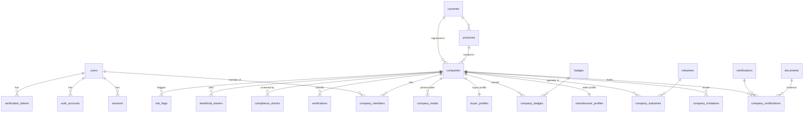
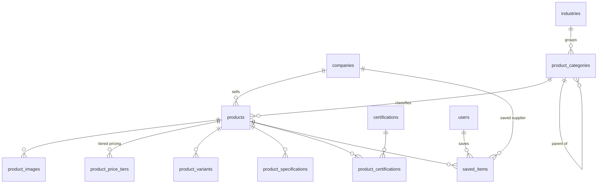
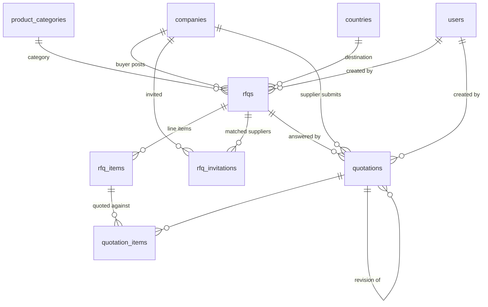
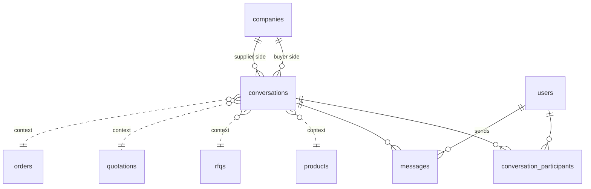
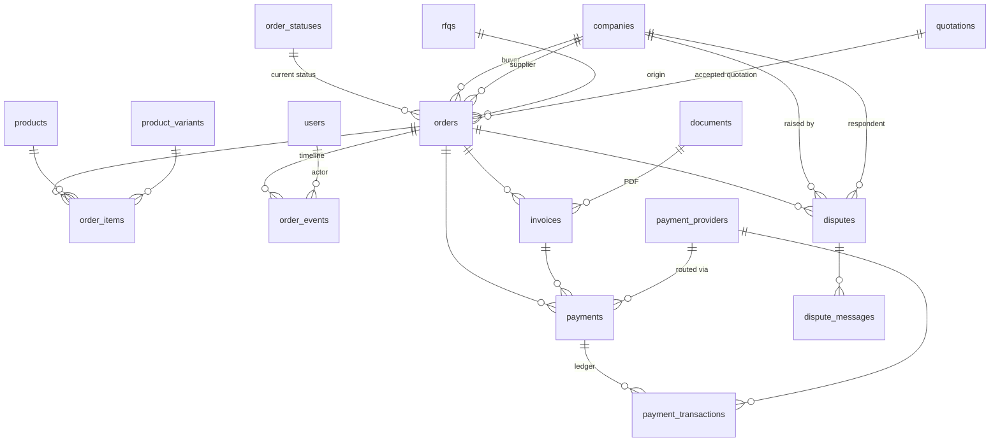
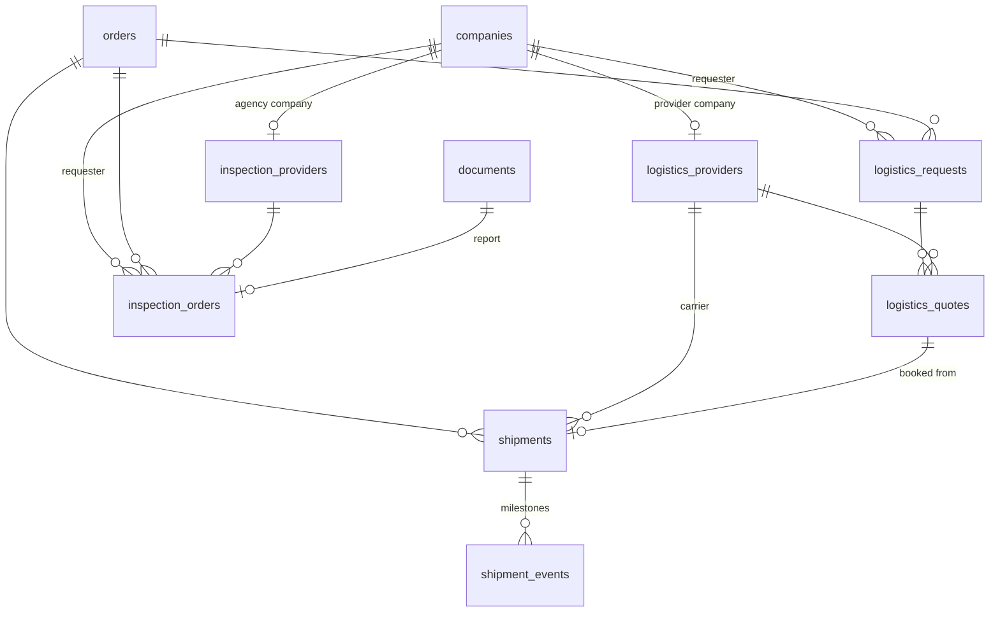
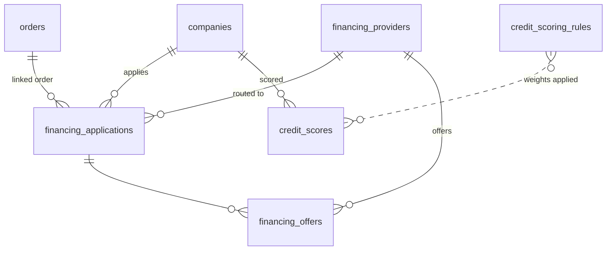
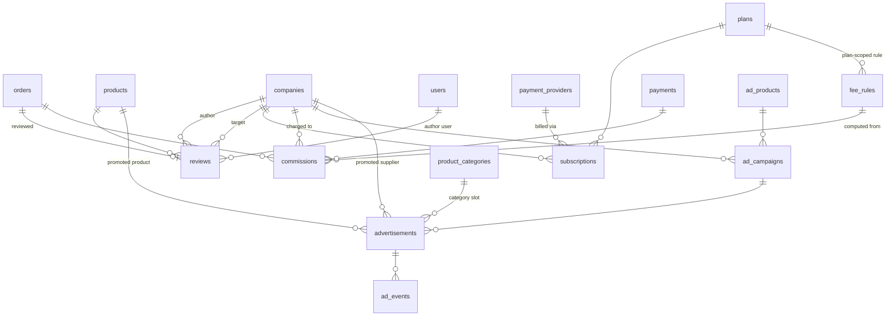
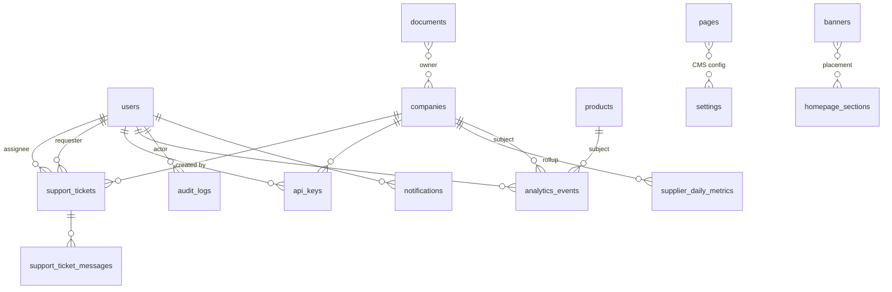

# 04 — Data Model

**83 tables**, defined in `src/db/schema/*.ts` (Drizzle) and mirrored for reading in `docs/er-model.prisma`
(Prisma notation, reference only). The Drizzle schema is authoritative. Migrations live in `drizzle/`:
`0000_extensions.sql` (extensions and immutable helper functions) and `0001_init.sql` (~1 860 lines, 459
statements: every enum, table, index and foreign key).

---

## 1. Conventions

### Identifiers

`id()` from `src/db/schema/_helpers.ts` → `text("id").primaryKey().$defaultFn(() => createId())`, a **cuid2**
string. Chosen over serial integers (no enumeration of business volume from a URL) and over UUIDv4 (cuid2 is
shorter, URL-safe and monotonic enough for index locality).

Five tables use a natural string primary key instead, because they are reference or configuration data whose
code *is* the identity and which is referenced by code from application logic:

| Table | PK |
|---|---|
| `countries` | ISO 3166-1 alpha-2 `code` |
| `currencies` | ISO 4217 `code` |
| `order_statuses` | `code` (e.g. `PURCHASE_ORDER`) |
| `settings` | `key` (e.g. `rfq.defaultValidityDays`) |

Two tables use composite primary keys for pure join relations: `company_industries (companyId, industryId)`
and `product_certifications (productId, certificationId)`.

### Timestamps and soft delete

`timestamps()` adds `createdAt` and `updatedAt`, both `timestamptz NOT NULL DEFAULT now()`, with `updatedAt`
maintained by Drizzle's `$onUpdate`. `softDelete()` adds a nullable `deletedAt`.

Soft delete is applied only where a record may need to disappear from the product without breaking history or
foreign keys: `users`, `companies`, `products`, `rfqs`, `quotations`, `orders`, `reviews`, `documents`,
`messages`. Everything else is hard-deleted or never deleted. **Every query against a soft-deletable table
must filter `isNull(x.deletedAt)`** — the search provider does this in SQL (`p.deleted_at IS NULL`).

Some append-only tables deliberately carry only `createdAt`: `sessions`, `verification_tokens`,
`company_invitations`, `company_media`, `product_images`, `product_price_tiers`, `product_specifications`,
`saved_items`, `rfq_items`, `rfq_invitations`, `quotation_items`, `messages`, `order_events`,
`payment_transactions`, `dispute_messages`, `shipment_events`, `credit_scores`, `ad_events`, `notifications`,
`audit_logs`, `analytics_events`, `support_ticket_messages`, `api_keys`.

### Money and numbers

| Helper | SQL type | Used for |
|---|---|---|
| `money(name)` | `numeric(18,4)` | Transactional amounts: prices, subtotals, totals, fees, payments, commissions |
| `money2(name)` | `numeric(18,2)` | Reporting and limit amounts: annual revenue, credit limits, budgets, GMV rollups |
| `rate(name)` | `numeric(12,4)` | Percentages and rates: response rate, interest rate, fee value, commission rate |
| `rating(name)` | `numeric(3,2)` | 0.00–5.00 star averages |

All four use Drizzle `mode: "number"`, so they surface as JavaScript numbers. `numeric(18,4)` gives 14
integer digits — enough for VND totals (a 10 billion VND order is 10 000 000 000, well inside the range) —
with four decimals for sub-cent fee arithmetic. **Never do float math on totals without rounding**:
`payments/service.ts` uses `round2`, `fees/engine.ts` uses `round4`.

Currency is always a sibling `currency text` column holding an ISO 4217 code; there is no implicit platform
currency. `currencies.rateToUsd` (`numeric(18,8)`) supports USD-normalised reporting.

### Localized text

Catalog and configuration text is localized in-row with a `Vi` suffix: `name`/`nameVi`,
`title`/`titleVi`, `description`/`descriptionVi`, `tagline`/`taglineVi`, `subtitle`/`subtitleVi`,
`clusterHeadline`/`clusterHeadlineVi`, `clusterDescription`/`clusterDescriptionVi`. `localized(row, "name",
locale)` in `src/lib/utils.ts` picks the right one with an English fallback.

This is deliberate for a two-locale product: it keeps listing queries to a single table scan and keeps the
search vector in one generated column. When `zh/ko/ja/ru/th/id` arrive, the migration path is a
`*_translations` table keyed `(entityId, locale)` with the two in-row columns kept as the fast path for
`en`/`vi`.

User-generated long-form content that is genuinely per-locale — CMS pages, e-mail templates — is already
row-per-locale: `pages` is unique on `(slug, locale)`, `email_templates` on `(code, locale)`,
`banners.locale` is nullable meaning "all locales".

### JSONB

Used in three disciplined ways, never as a general escape hatch:

1. **Configuration whose shape belongs to the operator, not the schema** — `badges.ruleConfig`,
   `fee_rules.tiers`, `plans.limits` (typed `PlanLimits`), `plans.features`, `homepage_sections.config`,
   `settings.value`, `payment_providers.publicConfig` / `feeConfig`, `financing_providers.routingRules` /
   `apiConfig`, `logistics_providers.apiConfig`, `inspection_providers.apiConfig`,
   `credit_scoring_rules.config`, `ad_campaigns.targeting`, `advertisements.creative`.
2. **Immutable snapshots** — `orders.tradeAssuranceTerms` (the protection terms as they stood when the order
   was placed), `orders.shippingAddress`/`billingAddress` (typed `Address`, deliberately denormalised so a
   later profile edit cannot rewrite a shipped order), `invoices.lineItems`, `credit_scores.features` and
   `breakdown`, `financing_offers.repaymentSchedule`, `inspection_orders.checklist`,
   `logistics_quotes.breakdown`, `compliance_checks.result`, `payment_transactions.rawResponse`.
3. **Extensible payloads** — `messages.payload` and `translations`, `order_events.data`, `risk_flags.data`,
   `verifications.data`, `notifications.data`, `audit_logs.before`/`after`, `analytics_events.metadata`,
   `ad_events.metadata`, `documents.metadata`, `companies.metadata`, `product_variants.attributes`,
   `order_items.specifications`, `provinces.keyFacts`, `payments.instructions`/`metadata`,
   `financing_applications.financialData`/`riskFactors`.

Every JSONB column is typed with Drizzle's `.$type<T>()` so TypeScript still checks reads and writes.

### Arrays

PostgreSQL arrays are used for small, unordered, queryable sets that never need their own row:
`text[]` for `languages`, `keywords`, `exportCountries`, `mainMarkets`, `sourcingCategories`,
`destinationCountries`, `majorIndustries`, `supportedCurrencies`, `supportedCountries`, `scopes`, `variables`,
`allowedTransitions`, and enum arrays for `acceptedIncoterms`, `preferredIncoterms`, `supportedMethods`,
`services`, `modes`, `products` (financing product types). Membership queries use `= ANY(col)` or
`col && ARRAY[...]`.

### Full-text search

`tsvector` is a Drizzle `customType`. Two tables carry **generated** search columns, so PostgreSQL maintains
them on every write and the application never touches them:

```sql
-- companies.search_vector
setweight(to_tsvector('simple', coalesce(name,        '')), 'A') ||
setweight(to_tsvector('simple', coalesce(name_vi,     '')), 'A') ||
setweight(to_tsvector('simple', coalesce(tagline,     '')), 'B') ||
setweight(to_tsvector('simple', coalesce(city,        '')), 'B') ||
setweight(to_tsvector('simple', coalesce(description, '')), 'C') ||
setweight(to_tsvector('simple', coalesce(description_vi, '')), 'C')

-- products.search_vector
setweight(to_tsvector('simple', coalesce(title,    '')), 'A') ||
setweight(to_tsvector('simple', coalesce(title_vi, '')), 'A') ||
setweight(to_tsvector('simple', immutable_array_to_string(keywords, ' ')), 'B') ||
setweight(to_tsvector('simple', coalesce(short_description, '')), 'B') ||
setweight(to_tsvector('simple', coalesce(brand,    '')), 'B') ||
setweight(to_tsvector('simple', coalesce(description,    '')), 'C') ||
setweight(to_tsvector('simple', coalesce(description_vi, '')), 'C')
```

Both are indexed `USING gin`. The `'simple'` dictionary is used rather than `'english'` because the corpus is
bilingual: English stemming would mangle Vietnamese, and Vietnamese has no bundled PostgreSQL dictionary.
Recall is recovered by prefix matching — `toTsQuery()` turns free text into `tok1:* & tok2:*`.

`0000_extensions.sql` creates `pg_trgm` and `unaccent`, plus two IMMUTABLE wrappers required because
generated columns and index expressions reject STABLE functions:

- `immutable_array_to_string(text[], text)` — used by `products.search_vector` for `keywords`.
- `immutable_unaccent(text)` — created for diacritics-insensitive matching. **Not yet wired into the
  generated columns**, so Vietnamese search is currently diacritics-sensitive (see
  [`07-mvp-boundaries.md`](07-mvp-boundaries.md) §4).

### Enum vs configurable table

The rule from `docs/er-model.prisma`: *inherent domain sets are enums; operator-owned sets are tables.*

| Configurable table | Why not an enum |
|---|---|
| `order_statuses` | Operators add stages (sampling, pre-production approval, customs hold) and edit `allowedTransitions` |
| `badges` | Rules and copy change; new badges are launched by marketing |
| `fee_rules` | Every commercial term must be editable without a deploy |
| `plans` | Pricing and limits change |
| `ad_products` | Inventory and pricing change |
| `payment_providers`, `financing_providers`, `logistics_providers`, `inspection_providers` | Partners are onboarded and rotated |
| `credit_scoring_rules` | Model weights are tuned |
| `homepage_sections`, `banners`, `pages`, `email_templates`, `settings` | Content and configuration |
| `industries`, `product_categories`, `certifications`, `provinces`, `countries`, `currencies` | Reference data grows |

Everything else is a PostgreSQL enum — 72 of them — because the value has code paths attached
(`paymentStatusEnum`, `rfqStatusEnum`, `incotermEnum`, `documentTypeEnum`, …). Adding a value to an enum is a
migration, which is the point: it forces the code change to be reviewed with it.

### Denormalised counters

Kept in sync by the service that mutates the source rows, never by triggers (so the write path is visible in
TypeScript): `companies.ratingAvg`, `ratingCount`, `transactionCount`, `transactionVolumeUsd`, `viewCount`,
`responseRate`, `avgResponseHours`; `products.viewCount`, `inquiryCount`, `rfqCount`, `orderCount`;
`product_categories.productCount`; `rfqs.viewCount`, `quotationCount`; `conversations.messageCount`,
`lastMessageAt`, `lastMessagePreview`; `advertisements.impressions`, `clicks`, `leads`, `rfqs`, `orders`;
`ad_campaigns.spent`; `invoices.amountPaid`; `logistics_providers.ratingAvg`;
`inspection_providers.ratingAvg`.

### Foreign keys

Almost all relations carry real foreign keys. Two deliberate exceptions:

1. **`documents`** — every link column (`orderId`, `rfqId`, `quotationId`, `messageId`, `verificationId`,
   `disputeId`, `shipmentId`, `financingApplicationId`) is plain `text` with **no** FK. This avoids a cycle of
   module imports (documents is imported by companies, compliance, orders, inspection…) and lets a document
   outlive the aggregate it was attached to, which matters for retention of KYB and trade documents.
2. **Self-referencing and forward references** — `product_categories.parentId`,
   `quotations.parentQuotationId`, `rfqs.awardedQuotationId`, `company_members.invitedById`,
   `financing_applications.acceptedOfferId`, `conversations.productId/rfqId/quotationId/orderId`,
   `saved_items.rfqId`, `sessions.activeCompanyId` are plain `text` to avoid circular table definitions.
   Integrity is enforced in the service layer.

`onDelete: "cascade"` is used where the child has no meaning without its parent (items, images, tiers,
variants, specifications, participants, messages, events, memberships, invitations, profiles, offers,
transactions). Money and history tables (`orders`, `payments`, `commissions`, `invoices`, `reviews`) use the
default `NO ACTION`, so an accidental delete fails loudly.

---

## 2. Entity-relationship diagrams

### 2.1 Identity, companies and trust



### 2.2 Catalog



### 2.3 RFQ and quotation



### 2.4 Messaging



### 2.5 Orders, payments and invoices



### 2.6 Logistics and inspection



### 2.7 Financing and credit



### 2.8 Reviews, monetization and advertising



### 2.9 Platform, CMS and system



---

## 3. Table reference

Columns listed are the identifying and load-bearing ones, not every column. "SD" = has `deletedAt`
(soft delete). "Config" = row-level operator configuration rather than transactional data.

### 3.1 Identity — `src/db/schema/identity.ts` (4)

| Table | Purpose | Key columns | Indexes | SD |
|---|---|---|---|---|
| `users` | Person account. Platform role lives here; company roles do not | `email`, `emailVerifiedAt`, `passwordHash`, `name`, `phone`, `phoneVerifiedAt`, `avatarUrl`, `locale`, `timezone`, `platformRole`, `status`, `twoFactorEnabled`, `twoFactorSecret`, `lastLoginAt`, `lastLoginIp` | unique `email`, unique `phone`, `status`, `platformRole` | yes |
| `auth_accounts` | External identity links (Google now, phone later) | `userId`, `provider`, `providerAccountId`, `accessToken`, `refreshToken`, `expiresAt` | unique `(provider, providerAccountId)`, `userId` | no |
| `sessions` | DB-backed sessions. `tokenHash` is HMAC-SHA256 of the cookie value, so a DB dump does not yield live sessions | `tokenHash`, `userId`, `activeCompanyId`, `ipAddress`, `userAgent`, `expiresAt`, `lastSeenAt` | unique `tokenHash`, `userId`, `expiresAt` | no |
| `verification_tokens` | Single-use tokens: e-mail verification, password reset, phone OTP, magic link, 2FA | `userId`, `identifier`, `tokenHash`, `purpose`, `expiresAt`, `consumedAt` | unique `tokenHash`, `(identifier, purpose)` | no |

`twoFactorEnabled`/`twoFactorSecret` and the `PHONE` auth provider are **reserved** — no code path uses them
yet (see [`05-permissions.md`](05-permissions.md) §7).

### 3.2 Reference — `src/db/schema/reference.ts` (6, all Config)

| Table | Purpose | Key columns | Indexes |
|---|---|---|---|
| `countries` | ISO countries with region and dial code | PK `code`, `name`, `nameVi`, `region`, `dialCode`, `isEnabled`, `sortOrder` | PK |
| `provinces` | Vietnamese provinces **and** industrial-cluster landing content | `countryCode`, `code`, `slug`, `name`, `nameVi`, `region`, `isIndustrialCluster`, `clusterHeadline(Vi)`, `clusterDescription(Vi)`, `heroImageUrl`, `majorIndustries[]`, `keyFacts`, `seoTitle`, `seoDescription` | unique `slug`, unique `(countryCode, code)`, `isIndustrialCluster` |
| `currencies` | ISO 4217 with USD rate and display metadata | PK `code`, `symbol`, `decimals`, `rateToUsd`, `isEnabled`, `isDefault` | PK |
| `industries` | 24 top-level industries | `slug`, `name`, `nameVi`, `icon`, `sortOrder`, `isActive` | unique `slug` |
| `product_categories` | Two-level category tree with materialised `path` | `parentId`, `industryId`, `slug`, `name`, `nameVi`, `level`, `path`, `isFeatured`, `seoTitle`, `seoDescription`, `productCount` | unique `slug`, `parentId`, `industryId`, `(isActive, sortOrder)` |
| `certifications` | Standards catalog (30 seeded: ISO, BSCI, WRAP, OEKO-TEX, FSC, HACCP, CE, RoHS, …) | `code`, `name`, `category`, `issuingBody`, `iconUrl` | unique `code` |

`product_categories.path` is a slash-joined chain of ancestor slugs, which makes subtree queries a single
`path LIKE 'apparel/%'` instead of a recursive CTE — the pattern the search provider relies on.

### 3.3 Documents — `src/db/schema/documents.ts` (1)

| Table | Purpose | Key columns | Indexes | SD |
|---|---|---|---|---|
| `documents` | Central file registry for every upload in the system | `ownerCompanyId`, `uploadedById`, `type`, `name`, `mimeType`, `sizeBytes`, `storageKey`, `url`, `checksum` (SHA-256), `visibility`, link columns `orderId`/`rfqId`/`quotationId`/`messageId`/`verificationId`/`disputeId`/`shipmentId`/`financingApplicationId`, `metadata` | `(ownerCompanyId, type)`, `orderId`, `rfqId`, `messageId`, `verificationId` | yes |

No foreign keys on the link columns (§1). `storageKey` never contains the original filename — the key is
`<scope>/<yyyy>/<mm>/<random>.<ext>`; the human name lives in `name`.

### 3.4 Companies — `src/db/schema/companies.ts` (10)

| Table | Purpose | Key columns | Indexes | SD |
|---|---|---|---|---|
| `companies` | The central account entity; buyer and seller capability are independent booleans | `slug`, `name`, `nameVi`, `legalName`, `businessType`, `isSeller`, `isBuyer`, `status`, `countryCode`, `provinceId`, `city`, `address`, `taxId`, `registrationNumber`, `website`, `logoUrl`, `coverUrl`, `tagline(Vi)`, `description(Vi)`, `yearEstablished`, `employeeRange`, `annualRevenueUsd`, `languages[]`, `verificationStatus`, `verifiedAt`, `kybStatus`, `sanctionsStatus`, `responseRate`, `avgResponseHours`, `ratingAvg`, `ratingCount`, `transactionCount`, `transactionVolumeUsd`, `viewCount`, `isFeatured`, `featuredUntil`, `searchBoost`, `seoTitle`, `seoDescription`, `metadata`, **`searchVector` (generated)** | unique `slug`, `(status, isSeller)`, `(status, isBuyer)`, `provinceId`, `countryCode`, `verificationStatus`, `businessType`, `ratingAvg`, **GIN `searchVector`** | yes |
| `company_members` | User ↔ company with a member role | `companyId`, `userId`, `role`, `title`, `status`, `isPrimary`, `invitedById`, `joinedAt` | unique `(companyId, userId)`, `userId` | no |
| `company_invitations` | Pending team invitations | `companyId`, `email`, `role`, `tokenHash`, `status`, `invitedById`, `expiresAt`, `acceptedAt` | unique `tokenHash`, `companyId`, `email` | no |
| `manufacturer_profiles` | Seller-side factory data (1:1 with a company) | `factoryAddress`, `factorySizeSqm`, `productionLines`, `annualCapacity(+Value/Unit)`, `oemCapable`, `odmCapable`, `privateLabelCapable`, `minOrderValueUsd`, `avgLeadTimeDays`, `sampleLeadTimeDays`, `exportCountries[]`, `mainMarkets[]`, `exportPercentage`, `exportExperienceYears`, `rdStaffCount`, `qcStaffCount`, `mainEquipment`, `mainMaterials`, `paymentTermsAccepted[]`, `acceptedIncoterms[]`, `videoUrls[]`, `factoryTourAvailable` | unique `companyId` | no |
| `buyer_profiles` | Buy-side sourcing data (1:1) | `sourcingCategories[]`, `annualPurchasingVolumeUsd`, `preferredCurrency`, `destinationCountries[]`, `preferredIncoterms[]`, `companySizeNote` | unique `companyId` | no |
| `company_industries` | Company ↔ industry, with a primary flag | composite PK `(companyId, industryId)`, `isPrimary` | PK, `industryId` | no |
| `company_certifications` | Held certifications with evidence and expiry | `companyId`, `certificationId`, `certificateNumber`, `issuedAt`, `expiresAt`, `documentId`, `status` | unique `(companyId, certificationId)` | no |
| `company_media` | Factory photos and videos | `companyId`, `kind`, `url`, `thumbnailUrl`, `caption`, `sortOrder` | `companyId` | no |
| `badges` *(Config)* | Badge definitions with `ruleConfig` | `code`, `name`, `nameVi`, `description(Vi)`, `icon`, `color`, `ruleConfig`, `isAutomatic`, `isActive`, `sortOrder` | unique `code` | no |
| `company_badges` | Granted badges | `companyId`, `badgeId`, `source` (RULE/MANUAL), `grantedById`, `grantedAt`, `expiresAt`, `note` | unique `(companyId, badgeId)` | no |

### 3.5 Compliance — `src/db/schema/compliance.ts` (4)

| Table | Purpose | Key columns | Indexes |
|---|---|---|---|
| `verifications` | Typed verification submissions and reviews | `companyId`, `type`, `status`, `data`, `notes`, `rejectionReason`, `submittedAt`, `reviewedAt`, `reviewedById`, `expiresAt` | `(companyId, type)`, `status` |
| `compliance_checks` | KYC/KYB/AML/sanctions/PEP/UBO/adverse-media/transaction-monitoring runs | `companyId`, `userId`, `type`, `provider`, `status`, `result`, `riskScore`, `checkedAt`, `reviewedById`, `nextReviewAt` | `(companyId, type)`, `status` |
| `beneficial_owners` | UBO register | `companyId`, `fullName`, `nationality`, `dateOfBirth`, `ownershipPercent`, `role`, `isPep`, `sanctionsStatus`, `idDocumentId` | `companyId` |
| `risk_flags` | Generic risk tripwire for any entity | `companyId`, `entityType`, `entityId`, `ruleCode`, `severity`, `status`, `description`, `data`, `resolvedById`, `resolvedAt`, `resolution` | `(entityType, entityId)`, `(status, severity)` |

### 3.6 Products — `src/db/schema/products.ts` (7)

| Table | Purpose | Key columns | Indexes | SD |
|---|---|---|---|---|
| `products` | Catalog item | `companyId`, `categoryId`, `slug`, `sku`, `title(Vi)`, `shortDescription`, `description(Vi)`, `status`, `rejectionReason`, `reviewedById`, `priceType`, `currency`, `basePrice`, `moq`, `unit`, `hasSample`, `samplePrice`, `sampleLeadDays`, `leadTimeDays`, `customizable`, `oemAvailable`, `odmAvailable`, `packagingDetails`, `shippingInfo`, `hsCode`, `originCountry`, `brand`, `model`, `videoUrl`, `keywords[]`, `viewCount`, `inquiryCount`, `rfqCount`, `orderCount`, `isFeatured`, `featuredUntil`, `searchBoost`, `seoTitle`, `seoDescription`, `publishedAt`, **`searchVector` (generated)** | unique `slug`, `(companyId, status)`, `(categoryId, status)`, `(status, publishedAt)`, `isFeatured`, **GIN `searchVector`** | yes |
| `product_images` | Gallery | `productId`, `url`, `alt`, `sortOrder`, `isPrimary`, `width`, `height` | `productId` | no |
| `product_price_tiers` | Quantity-break pricing | `productId`, `minQty`, `maxQty` (null = "and above"), `price`, `currency` | `productId` | no |
| `product_variants` | SKU variants with a typed attribute map | `productId`, `sku`, `name`, `attributes` (`Record<string,string>`), `price`, `moq`, `imageUrl`, `isActive`, `sortOrder` | `productId` | no |
| `product_specifications` | Name/value/unit spec rows | `productId`, `name`, `value`, `unit`, `sortOrder` | `productId` | no |
| `product_certifications` | Product ↔ certification | composite PK `(productId, certificationId)` | PK | no |
| `saved_items` | Buyer bookmarks for suppliers, products and RFQs | `userId`, `type`, `productId`, `supplierCompanyId`, `rfqId`, `note` | unique `(userId, productId)`, `(userId, supplierCompanyId)`, `(userId, rfqId)`, `(userId, type)` | no |

The three partial-looking unique indexes on `saved_items` work because PostgreSQL treats NULLs as distinct:
each row populates exactly one of the three reference columns.

### 3.7 RFQ and quotation — `src/db/schema/rfq.ts` (5)

| Table | Purpose | Key columns | Indexes | SD |
|---|---|---|---|---|
| `rfqs` | Buyer sourcing request | `rfqNumber`, `buyerCompanyId`, `createdById`, `categoryId`, `title`, `description`, `quantity`, `unit`, `targetPrice`, `targetCurrency`, `destinationCountryCode`, `destinationCity`, `incoterm`, `preferredPaymentTerms`, `quoteDeadline`, `requiredDeliveryDate`, `certificationRequirements`, `customizationRequirements`, `packagingRequirements`, `sampleRequired`, `status`, `visibility`, `isPriority`, `viewCount`, `quotationCount`, `awardedQuotationId`, `publishedAt`, `closedAt`, `expiresAt` | unique `rfqNumber`, `(buyerCompanyId, status)`, `(status, publishedAt)`, `(categoryId, status)` | yes |
| `rfq_items` | Line items | `rfqId`, `productName`, `specifications`, `quantity`, `unit`, `targetPrice`, `notes`, `sortOrder` | `rfqId` | no |
| `rfq_invitations` | Matched or explicitly invited suppliers | `rfqId`, `supplierCompanyId`, `status`, `notifiedAt`, `viewedAt` | unique `(rfqId, supplierCompanyId)`, `(supplierCompanyId, status)` | no |
| `quotations` | Supplier response; revisions chain via `parentQuotationId` | `quotationNumber`, `rfqId`, `supplierCompanyId`, `createdById`, `status`, `revisionNumber`, `parentQuotationId`, `currency`, `subtotal`, `shippingCost`, `discount`, `total`, `moq`, `leadTimeDays`, `incoterm`, `shippingMethod`, `paymentTerms`, `validUntil`, `notes`, `sampleAvailable`, `samplePrice`, `buyerNotes` (buyer-private), `submittedAt`, `respondedAt` | unique `quotationNumber`, `(rfqId, status)`, `(supplierCompanyId, status)` | yes |
| `quotation_items` | Priced lines, optionally mapped to an RFQ item | `quotationId`, `rfqItemId`, `description`, `quantity`, `unit`, `unitPrice`, `total`, `notes`, `sortOrder` | `quotationId` | no |

`rfqs.isPriority` backs the `RFQ_BOOST` ad product.

### 3.8 Messaging — `src/db/schema/messaging.ts` (3)

| Table | Purpose | Key columns | Indexes | SD |
|---|---|---|---|---|
| `conversations` | Thread with an explicit business context | `subject`, `context`, `status`, `buyerCompanyId`, `supplierCompanyId`, `productId`, `rfqId`, `quotationId`, `orderId`, `lastMessageAt`, `lastMessagePreview`, `messageCount` | `(buyerCompanyId, lastMessageAt)`, `(supplierCompanyId, lastMessageAt)`, `orderId`, `rfqId`, `productId` | no |
| `conversation_participants` | Who is in the thread, per-user read state | `conversationId`, `userId`, `companyId`, `lastReadAt`, `isMuted`, `joinedAt` | unique `(conversationId, userId)`, `userId` | no |
| `messages` | Message with type and structured payload | `conversationId`, `senderId`, `type`, `body`, `bodyLang`, `translations`, `payload`, `editedAt` | `(conversationId, createdAt)` | yes |

`bodyLang` and `translations` are the translation-ready hooks: a provider fills `translations` keyed by
locale; the UI picks the viewer's locale and falls back to `body`.

### 3.9 Orders — `src/db/schema/orders.ts` (5)

| Table | Purpose | Key columns | Indexes | SD |
|---|---|---|---|---|
| `order_statuses` *(Config)* | The lifecycle itself | PK `code`, `name`, `nameVi`, `description`, `sortOrder`, `color`, `isTerminal`, `isCancellable`, `allowedTransitions[]`, `isActive` | PK | no |
| `orders` | The transaction | `orderNumber`, `buyerCompanyId`, `supplierCompanyId`, `rfqId`, `quotationId`, `statusCode` → `order_statuses`, `currency`, `subtotal`, `shippingCost`, `taxAmount`, `discount`, `total`, `platformFee`, `incoterm`, `paymentTerms`, `depositPercent`, `tradeAssuranceEnabled`, `tradeAssuranceTerms`, `expectedProductionDays`, `expectedShipDate`, `expectedDeliveryDate`, `shippingAddress`, `billingAddress`, `buyerNotes`, `supplierNotes`, `internalNotes`, `placedAt`, `confirmedAt`, `shippedAt`, `deliveredAt`, `completedAt`, `cancelledAt`, `cancellationReason` | unique `orderNumber`, `(buyerCompanyId, statusCode)`, `(supplierCompanyId, statusCode)`, `statusCode`, `createdAt` | yes |
| `order_items` | Line items with a spec snapshot | `orderId`, `productId`, `variantId`, `description`, `specifications`, `quantity`, `unit`, `unitPrice`, `total`, `hsCode`, `sortOrder` | `orderId` | no |
| `order_events` | Append-only timeline with per-side visibility | `orderId`, `type`, `fromStatus`, `toStatus`, `title`, `description`, `data`, `actorId`, `isVisibleToBuyer`, `isVisibleToSupplier` | `(orderId, createdAt)` | no |
| `invoices` | Proforma, commercial, credit note, platform fee | `invoiceNumber`, `orderId`, `type`, `issuerCompanyId`, `recipientCompanyId`, `status`, `currency`, `subtotal`, `taxAmount`, `total`, `amountPaid`, `lineItems`, `notes`, `documentId`, `issuedAt`, `dueAt`, `paidAt` | unique `invoiceNumber`, `orderId`, `(recipientCompanyId, status)`, `(issuerCompanyId, status)` | no |

`orders.platformFee` is a convenience column; the authoritative fee record is the `commissions` ledger.

### 3.10 Payments and disputes — `src/db/schema/payments.ts` (5)

| Table | Purpose | Key columns | Indexes |
|---|---|---|---|
| `payment_providers` *(Config)* | A licensed partner and the adapter that talks to it | `code`, `name`, `type`, `adapterCode`, `supportedMethods[]`, `supportedCurrencies[]`, `supportedCountries[]`, `supportsEscrow`, `licenseInfo`, `publicConfig` (non-secret), `feeConfig`, `isActive`, `isDefault`, `sortOrder` | unique `code` |
| `payments` | One scheduled or ad-hoc money movement | `paymentNumber`, `orderId`, `invoiceId`, `payerCompanyId`, `payeeCompanyId`, `providerId`, `providerReference`, `kind`, `method`, `status`, `escrowStatus`, `currency`, `amount`, `feeAmount`, `netAmount`, `milestoneLabel`, `instructions`, `dueAt`, `paidAt`, `settledAt`, `releasedAt`, `refundedAt`, `failureReason`, `metadata` | unique `paymentNumber`, `orderId`, `(payerCompanyId, status)`, `(payeeCompanyId, status)`, `status` |
| `payment_transactions` | Immutable ledger of provider interactions | `paymentId`, `providerId`, `type` (CHARGE/AUTHORIZATION/CAPTURE/RELEASE/REFUND/PAYOUT/FEE/ADJUSTMENT), `status`, `currency`, `amount`, `providerTxnId`, `rawResponse`, `note` | `paymentId` |
| `disputes` | Order dispute case | `disputeNumber`, `orderId`, `raisedByCompanyId`, `respondentCompanyId`, `type`, `status`, `title`, `description`, `claimedAmount`, `currency`, `resolution`, `resolutionAmount`, `resolvedById`, `respondBy`, `resolvedAt`, `closedAt` | unique `disputeNumber`, `orderId`, `status` |
| `dispute_messages` | Case correspondence; `isInternal` hides staff notes | `disputeId`, `authorId`, `body`, `isInternal` | `(disputeId, createdAt)` |

`secrets` never live in `payment_providers`: `publicConfig` holds bank details and display data only; API
credentials come from environment variables read by the adapter.

### 3.11 Logistics — `src/db/schema/logistics.ts` (5)

| Table | Purpose | Key columns | Indexes |
|---|---|---|---|
| `logistics_providers` *(Config)* | Forwarder / carrier partner | `companyId` (optional link to a marketplace company), `code`, `name`, `logoUrl`, `services[]`, `modes[]`, `countries[]`, `adapterCode`, `apiConfig`, `ratingAvg`, `isActive` | unique `code`, unique `companyId` |
| `logistics_requests` | Quote request | `requestNumber`, `requesterCompanyId`, `orderId`, `status`, `services[]`, `preferredMode`, `originAddress`, `destinationAddress`, `originCountryCode`, `destinationCountryCode`, `incoterm`, `cargoDescription`, `hsCode`, `packages`, `grossWeightKg`, `volumeCbm`, `containerType`, `cargoValue`, `insuranceRequired`, `readyDate`, `requiredDeliveryDate`, `quoteDeadline` | unique `requestNumber`, `(requesterCompanyId, status)`, `orderId` |
| `logistics_quotes` | Provider response | `requestId`, `providerId`, `status`, `currency`, `amount`, `breakdown`, `mode`, `transitDays`, `validUntil`, `notes` | `requestId`, `(providerId, status)` |
| `shipments` | The booked movement | `shipmentNumber`, `orderId`, `providerId`, `logisticsQuoteId`, `status`, `mode`, `carrier`, `trackingNumber`, `containerNumber`, `vesselOrFlight`, `incoterm`, `originAddress`/`originPort`, `destinationPort`/`destinationAddress`, `packages`, `grossWeightKg`, `volumeCbm`, `etd`, `eta`, `actualDeparture`, `actualArrival`, `deliveredAt`, `insured`, `insuranceValue`, `cost` | unique `shipmentNumber`, `orderId`, `status` |
| `shipment_events` | Milestone feed | `shipmentId`, `milestone`, `status`, `location`, `description`, `source` (manual / provider-api / webhook), `occurredAt` | `(shipmentId, occurredAt)` |

### 3.12 Inspection — `src/db/schema/inspection.ts` (2)

| Table | Purpose | Key columns | Indexes |
|---|---|---|---|
| `inspection_providers` *(Config)* | Inspection agency | `companyId`, `code`, `name`, `logoUrl`, `services[]` (inspection types), `countries[]`, `adapterCode`, `apiConfig`, `ratingAvg`, `isActive` | unique `code`, unique `companyId` |
| `inspection_orders` | An inspection engagement | `inspectionNumber`, `orderId`, `requesterCompanyId`, `providerId`, `type`, `status`, `result`, `factoryAddress`, `requestedDate`, `scheduledAt`, `completedAt`, `checklist`, `findings`, `fee`, `currency`, `reportDocumentId`, `notes` | unique `inspectionNumber`, `orderId`, `(requesterCompanyId, status)` |

### 3.13 Financing and credit — `src/db/schema/financing.ts` (5)

| Table | Purpose | Key columns | Indexes |
|---|---|---|---|
| `financing_providers` *(Config)* | Licensed lender / factor | `code`, `name`, `type`, `licenseNumber`, `regulator`, `products[]`, `countries[]`, `currencies[]`, `minAmount`, `maxAmount`, `minTenorDays`, `maxTenorDays`, `indicativeRate`, `adapterCode`, `apiConfig`, `routingRules`, `isActive` | unique `code` |
| `financing_applications` | An application, routed to a provider | `applicationNumber`, `companyId`, `orderId`, `side` (BUYER/SELLER), `productType`, `status`, `providerId`, `amount`, `currency`, `purpose`, `requestedTenorDays`, `financialData`, `riskScore`, `riskGrade`, `riskScoreVersion`, `riskFactors`, `acceptedOfferId`, `submittedAt`, `routedAt`, `decidedAt`, `fundedAt`, `repaidAt`, `declineReason` | unique `applicationNumber`, `(companyId, status)`, `orderId`, `(providerId, status)` |
| `financing_offers` | A lender's terms | `applicationId`, `providerId`, `status`, `amount`, `currency`, `interestRate`, `feePercent`, `feeAmount`, `tenorDays`, `repaymentSchedule`, `terms`, `validUntil`, `acceptedAt` | `applicationId` |
| `credit_scoring_rules` *(Config)* | Weighted feature rules | `code`, `name`, `feature`, `weight`, `config` (buckets / map), `version`, `isActive` | unique `code` |
| `credit_scores` | Immutable score snapshot | `companyId`, `score`, `grade`, `version`, `features`, `breakdown`, `computedAt` | `(companyId, computedAt)` |

`credit_scores` is append-only so a lending decision can always be re-justified against the exact inputs that
existed at the time.

### 3.14 Reviews — `src/db/schema/reviews.ts` (1)

| Table | Purpose | Key columns | Indexes | SD |
|---|---|---|---|---|
| `reviews` | Five-dimension review with anti-fraud metadata | `orderId`, `productId`, `authorCompanyId`, `authorUserId`, `targetCompanyId`, `ratingQuality`, `ratingCommunication`, `ratingDelivery`, `ratingAccuracy`, `ratingService`, `ratingOverall`, `title`, `body`, `isVerifiedPurchase`, `status`, `fraudScore`, `fraudSignals`, `moderatedById`, `moderationNote`, `reply`, `repliedAt`, `publishedAt` | unique `(orderId, authorCompanyId)`, `(targetCompanyId, status)`, `(productId, status)` | yes |

### 3.15 Monetization — `src/db/schema/monetization.ts` (4)

| Table | Purpose | Key columns | Indexes |
|---|---|---|---|
| `plans` *(Config)* | Subscription tiers | `code`, `tier`, `name`, `nameVi`, `priceMonthly`, `priceYearly`, `currency`, `features` (string[]), `limits` (`PlanLimits`), `isActive`, `isPublic`, `sortOrder` | unique `code` |
| `subscriptions` | A company's active plan | `companyId`, `planId`, `status`, `billingCycle`, `currentPeriodStart`, `currentPeriodEnd`, `cancelAtPeriodEnd`, `trialEndsAt`, `paymentProviderId`, `externalId`, `cancelledAt` | `(companyId, status)` |
| `fee_rules` *(Config)* | Every platform fee | `code`, `name`, `type`, `calc`, `value`, `tiers`, `currency`, `minFee`, `maxFee`, `planId`, `categorySlug`, `countryCode`, `paidBy`, `priority`, `isActive`, `validFrom`, `validTo`, `description` | unique `code`, `(type, isActive)` |
| `commissions` | Computed fee ledger | `companyId`, `orderId`, `paymentId`, `feeRuleId`, `type`, `status`, `currency`, `baseAmount`, `rate`, `amount`, `note`, `collectedAt` | `(companyId, status)`, `orderId` |

`PlanLimits` is a typed object: `maxProducts`, `maxRfqResponsesPerMonth`, `analytics`, `rfqPriority`,
`searchBoost`, `verificationIncluded`, `teamSeats`, `apiAccess`, `featuredSlots` (`null` means unlimited).

### 3.16 Advertising — `src/db/schema/advertising.ts` (4)

| Table | Purpose | Key columns | Indexes |
|---|---|---|---|
| `ad_products` *(Config)* | Sellable ad inventory | `code`, `placement`, `name`, `nameVi`, `pricingModel`, `price`, `currency`, `minBudget`, `maxSlots`, `isActive` | unique `code` |
| `ad_campaigns` | Buyer of the inventory | `companyId`, `adProductId`, `name`, `status`, `budget`, `spent`, `dailyBudget`, `currency`, `startAt`, `endAt`, `targeting`, `rejectionReason` | `(companyId, status)`, `(status, startAt, endAt)` |
| `advertisements` | The individual placement + counters | `campaignId`, `placement`, `productId`, `supplierCompanyId`, `categoryId`, `keyword`, `creative`, `impressions`, `clicks`, `leads`, `rfqs`, `orders`, `isActive` | `(placement, isActive)`, `(categoryId, placement)` |
| `ad_events` | Per-event log with cost at `numeric(18,6)` | `advertisementId`, `type`, `userId`, `sessionId`, `cost`, `metadata` | `(advertisementId, type, createdAt)` |

### 3.17 System, analytics and CMS — `src/db/schema/system.ts` (12)

| Table | Purpose | Key columns | Indexes |
|---|---|---|---|
| `notifications` | In-app notification inbox (e-mail is sent alongside, not stored here) | `userId`, `type`, `channel`, `title`, `body`, `link`, `data`, `readAt`, `sentAt` | `(userId, readAt, createdAt)` |
| `audit_logs` | Append-only audit trail with before/after snapshots | `actorId`, `actorType`, `action` (dotted), `entityType`, `entityId`, `before`, `after`, `ipAddress`, `userAgent` | `(entityType, entityId)`, `(actorId, createdAt)`, `action` |
| `analytics_events` | Raw behavioural events | `type`, `userId`, `companyId`, `productId`, `sessionId`, `path`, `referrer`, `countryCode`, `metadata` | `(type, createdAt)`, `(companyId, type, createdAt)`, `(productId, type, createdAt)` |
| `supplier_daily_metrics` | Pre-aggregated supplier dashboard rollup | `companyId`, `date`, `views`, `productViews`, `leads`, `rfqsReceived`, `quotations`, `orders`, `gmvUsd`, `adImpressions`, `adClicks`, `adSpendUsd` | unique `(companyId, date)` |
| `api_keys` | Company API credentials | `companyId`, `createdById`, `name`, `prefix`, `keyHash`, `scopes[]`, `status`, `lastUsedAt`, `expiresAt`, `revokedAt` | unique `keyHash`, `companyId` |
| `pages` *(Config)* | CMS markdown pages: PAGE / GUIDE / LEGAL / BLOG / HELP | `slug`, `locale`, `type`, `title`, `excerpt`, `content`, `coverImageUrl`, `status`, `seoTitle`, `seoDescription`, `publishedAt` | unique `(slug, locale)`, `(type, status)` |
| `banners` *(Config)* | Placement-driven promotional banners | `placement`, `locale`, `title`, `subtitle`, `imageUrl`, `ctaLabel`, `ctaUrl`, `isActive`, `startAt`, `endAt` | `(placement, isActive)` |
| `homepage_sections` *(Config)* | Homepage composition | `key`, `title`, `titleVi`, `subtitle(Vi)`, `config`, `sortOrder`, `isActive` | unique `key` |
| `email_templates` *(Config)* | Transactional e-mail bodies per locale | `code`, `locale`, `subject`, `bodyHtml`, `bodyText`, `variables[]`, `isActive` | unique `(code, locale)` |
| `settings` *(Config)* | Typed platform settings | PK `key`, `group`, `value` (JSONB), `description`, `isPublic` | PK |
| `support_tickets` | Support queue | `ticketNumber`, `requesterId`, `companyId`, `assigneeId`, `subject`, `category`, `priority`, `status` | unique `ticketNumber`, `status`, `requesterId` |
| `support_ticket_messages` | Ticket thread; `isInternal` hides staff notes | `ticketId`, `authorId`, `body`, `isInternal` | `ticketId` |

---

## 4. Table count by domain

| Domain | Tables |
|---|---|
| Identity | 4 |
| Reference | 6 |
| Documents | 1 |
| Companies | 10 |
| Compliance | 4 |
| Products | 7 |
| RFQ & quotation | 5 |
| Messaging | 3 |
| Orders | 5 |
| Payments & disputes | 5 |
| Logistics | 5 |
| Inspection | 2 |
| Financing & credit | 5 |
| Reviews | 1 |
| Monetization | 4 |
| Advertising | 4 |
| System / analytics / CMS | 12 |
| **Total** | **83** |

Relations for Drizzle's relational query API are declared separately in `src/db/schema/relations.ts` (537
lines), which is what makes `db.query.rfqs.findFirst({ with: { items: true, quotations: { with: {...} } } })`
work.
