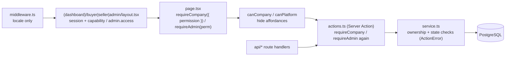

# 05 — Permissions

Authorisation in CANG has two independent axes, both defined in one file — `src/modules/auth/rbac.ts` — which
UI and server code import. This document renders that file as tables and explains where and how the checks
are enforced. If a table here and `rbac.ts` ever disagree, `rbac.ts` wins; regenerate the table.

| Axis | Stored on | Roles | Checked with |
|---|---|---|---|
| **Platform role** | `users.platformRole` (`platform_role` enum) | `USER`, `SUPPORT`, `MODERATOR`, `FINANCE`, `COMPLIANCE`, `ADMIN`, `SUPER_ADMIN` | `platformCan(role, permission)` |
| **Member role** | `company_members.role` (`member_role` enum) | `OWNER`, `ADMIN`, `MANAGER`, `SALES`, `PURCHASING`, `FINANCE`, `STAFF`, `VIEWER` | `memberCan(role, permission)` |

A user has exactly one platform role and zero or more memberships. Every request resolves at most one
**active membership** (`sessions.activeCompanyId`, switchable with `switchCompanyAction`), and all company
permission checks run against that membership's role. Staff accounts (`platformRole ≠ USER`) may also hold
memberships, which is how an internal test buyer works; the two axes never blend — `admin.*` permissions
never grant company permissions and vice versa.

---

## 1. Platform role × permission

Rendered from `PLATFORM_PERMISSIONS` and `PLATFORM_ROLE_PERMISSIONS`. `●` = granted.

| Permission | USER | SUPPORT | MODERATOR | FINANCE | COMPLIANCE | ADMIN | SUPER_ADMIN |
|---|:-:|:-:|:-:|:-:|:-:|:-:|:-:|
| `admin.access` | · | ● | ● | ● | ● | ● | ● |
| `admin.users.read` | · | ● | ● | · | ● | ● | ● |
| `admin.users.write` | · | · | · | · | · | ● | ● |
| `admin.companies.read` | · | ● | ● | ● | ● | ● | ● |
| `admin.companies.write` | · | · | · | · | ● | ● | ● |
| `admin.verification.review` | · | · | · | · | ● | ● | ● |
| `admin.compliance.review` | · | · | · | · | ● | ● | ● |
| `admin.products.moderate` | · | · | ● | · | · | ● | ● |
| `admin.categories.write` | · | · | · | · | · | ● | ● |
| `admin.rfqs.read` | · | ● | ● | · | · | ● | ● |
| `admin.rfqs.write` | · | · | ● | · | · | ● | ● |
| `admin.orders.read` | · | ● | · | ● | · | ● | ● |
| `admin.orders.write` | · | · | · | · | · | ● | ● |
| `admin.payments.read` | · | ● | · | ● | · | ● | ● |
| `admin.payments.write` | · | · | · | ● | · | ● | ● |
| `admin.financing.read` | · | · | · | ● | · | ● | ● |
| `admin.financing.write` | · | · | · | ● | · | ● | ● |
| `admin.logistics.write` | · | · | · | · | · | ● | ● |
| `admin.disputes.resolve` | · | · | · | · | ● | ● | ● |
| `admin.reviews.moderate` | · | · | ● | · | · | ● | ● |
| `admin.fees.write` | · | · | · | ● | · | ● | ● |
| `admin.plans.write` | · | · | · | ● | · | ● | ● |
| `admin.advertising.write` | · | · | · | · | · | ● | ● |
| `admin.cms.write` | · | · | ● | · | · | ● | ● |
| `admin.settings.write` | · | · | · | · | · | · | ● |
| `admin.audit.read` | · | · | · | · | ● | ● | ● |
| `admin.support.write` | · | ● | · | · | · | ● | ● |
| `admin.analytics.read` | · | · | · | ● | · | ● | ● |
| **Total** | 0 | 7 | 8 | 10 | 8 | 27 | 28 |

### Role intent

| Role | Who | Design note |
|---|---|---|
| `USER` | Every marketplace account | No admin console access at all; `admin.access` is the gate the admin layout checks |
| `SUPPORT` | Customer support agents | Read-only across users, companies, RFQs, orders and payments so they can answer tickets; the only write is `admin.support.write` |
| `MODERATOR` | Content and catalogue moderation | Approves/rejects products, moderates reviews, edits and boosts RFQs, edits CMS pages. No money, no compliance |
| `FINANCE` | Finance operations | Confirms manual bank transfers, releases and refunds escrow (`admin.payments.write`), manages financing routing, fee rules and plans, reads analytics. Cannot touch users or verification |
| `COMPLIANCE` | KYB/AML reviewers, dispute mediators | Reviews verifications and compliance checks, resolves disputes, may suspend companies (`admin.companies.write`), reads the audit log. Deliberately **cannot** move money |
| `ADMIN` | Platform operators | Everything except `admin.settings.write` |
| `SUPER_ADMIN` | Founders / on-call engineers | Everything; the only role that may edit `settings` (fee toggles, compliance switches, moderation flags) |

Separation of duties is explicit: the role that can decide a dispute (`COMPLIANCE`) is not the role that can
execute the refund (`FINANCE`). A refund after a dispute therefore involves two people or an `ADMIN`, and both
steps are audited.

---

## 2. Member role × company permission

Rendered from `COMPANY_PERMISSIONS` and `MEMBER_ROLE_PERMISSIONS`.

| Permission | OWNER | ADMIN | MANAGER | SALES | PURCHASING | FINANCE | STAFF | VIEWER |
|---|:-:|:-:|:-:|:-:|:-:|:-:|:-:|:-:|
| `company.profile.read` | ● | ● | ● | ● | ● | ● | ● | ● |
| `company.profile.write` | ● | ● | ● | · | · | · | · | · |
| `company.members.manage` | ● | ● | · | · | · | · | · | · |
| `company.verification.submit` | ● | ● | ● | · | · | · | · | · |
| `company.billing.manage` | ● | · | · | · | · | ● | · | · |
| `company.apikeys.manage` | ● | ● | · | · | · | · | · | · |
| `products.read` | ● | ● | ● | ● | · | · | ● | ● |
| `products.write` | ● | ● | ● | ● | · | · | · | · |
| `products.publish` | ● | ● | ● | · | · | · | · | · |
| `rfq.read` | ● | ● | ● | ● | ● | · | ● | ● |
| `rfq.write` | ● | ● | ● | · | ● | · | · | · |
| `quotation.read` | ● | ● | ● | ● | ● | · | ● | ● |
| `quotation.write` | ● | ● | ● | ● | · | · | · | · |
| `orders.read` | ● | ● | ● | ● | ● | ● | ● | ● |
| `orders.write` | ● | ● | ● | · | ● | · | · | · |
| `payments.read` | ● | ● | ● | · | · | ● | · | · |
| `payments.write` | ● | ● | · | · | · | ● | · | · |
| `messages.read` | ● | ● | ● | ● | ● | · | ● | ● |
| `messages.write` | ● | ● | ● | ● | ● | · | ● | · |
| `logistics.manage` | ● | ● | ● | · | ● | · | · | · |
| `financing.apply` | ● | ● | · | · | · | ● | · | · |
| `disputes.manage` | ● | ● | ● | · | · | · | · | · |
| `reviews.write` | ● | ● | ● | · | ● | · | · | · |
| `advertising.manage` | ● | ● | ● | · | · | · | · | · |
| `analytics.read` | ● | ● | ● | ● | · | ● | · | · |
| **Total** | 25 | 24 | 20 | 10 | 10 | 7 | 7 | 6 |

### Role intent

| Role | Typical person | Design note |
|---|---|---|
| `OWNER` | The registrant; `createCompanyForUser` always creates one `OWNER` with `isPrimary = true` | All 25 permissions. The only role with both `company.billing.manage` and `company.members.manage` |
| `ADMIN` | Co-founder, general manager | Everything except billing — plan changes and invoices stay with the owner or a finance member |
| `MANAGER` | Sales/export manager, plant manager | Runs the day-to-day: products, RFQs, quotations, orders, logistics, disputes, ads. Cannot manage members, billing, API keys or apply for financing |
| `SALES` | Supplier-side account executive | Writes products and quotations, chats with buyers, reads orders and analytics. Cannot publish products (`products.publish`) or write orders |
| `PURCHASING` | Buyer-side procurement | Writes RFQs, accepts quotations into orders (`orders.write`), books logistics, reviews suppliers. Cannot see payments |
| `FINANCE` | Accountant / CFO on either side | Payments read+write, financing applications, billing, analytics. Cannot see RFQs or messages |
| `STAFF` | Generic operational staff | Read across catalogue/RFQ/quotation/orders plus messaging write |
| `VIEWER` | Auditors, advisers, interns | Read-only, no messaging |

Capability (`companies.isBuyer` / `companies.isSeller`) is orthogonal to role: a `PURCHASING` member of a
seller-only company still cannot open the buyer dashboard, because the layout guard checks capability before
any permission is consulted.

---

## 3. Enforcement points

Checks run in layers. Each layer is sufficient on its own; the outer layers exist for UX (redirect instead of
error) and the inner ones for safety (an action invoked outside its page is still refused).

### 3.1 Middleware

`src/middleware.ts` is next-intl only: it negotiates and prefixes the locale and never reads the session.
Authentication is intentionally *not* in middleware, because the session lookup is a database query and the
`AuthContext` is needed by layouts anyway; doing it once in `getAuth()` (React `cache()`, per request) avoids
a second round-trip.

### 3.2 Dashboard layout guards

| Layout | Check | On failure |
|---|---|---|
| `(dashboard)/buyer/layout.tsx` | `getAuth()` non-null → `activeMembership` exists → `company.isBuyer` | `/login?next=/buyer` → `/onboarding` → `/onboarding?enable=BUYER` |
| `(dashboard)/seller/layout.tsx` | same, with `company.isSeller` | `/login?next=/seller` → `/onboarding` → `/onboarding?enable=SELLER` |
| `(dashboard)/admin/layout.tsx` | `getAuth()` non-null → `platformCan(role, "admin.access")` | `/login?next=/admin` → `/` |

Layouts redirect; they do not throw. The `DashboardShell` they render receives the `AuthContext`, which is
how the sidebar and the company switcher know what to show.

### 3.3 Page and action guards — `src/modules/auth/current-user.ts`

| Helper | Returns | Throws |
|---|---|---|
| `getAuth()` | `AuthContext \| null` — `{ user, sessionId, memberships, activeMembership }`; cached per request | never |
| `requireAuth()` | `AuthContext` | `UnauthorizedError` (`code: "UNAUTHORIZED"`) |
| `requireCompany({ permission?, seller?, buyer? })` | `AuthContext & { membership, company }` | `ForbiddenError` when there is no active membership, when `memberCan(role, permission)` is false, or when the requested capability is missing |
| `requireAdmin(permission = "admin.access")` | `AuthContext` | `ForbiddenError` when `platformCan(role, permission)` is false |
| `canCompany(auth, permission)` / `canPlatform(auth, permission)` | `boolean` | never — for conditional rendering |

`getAuth` also treats a `SUSPENDED` / `DEACTIVATED` / soft-deleted user as anonymous, so suspending a user
invalidates every one of their sessions without touching the `sessions` table.

`ForbiddenError` and `UnauthorizedError` extend `ActionError`; inside `runAction` they become a typed
`{ ok: false, code }` result that the form renders, instead of a 500.

### 3.4 Server Actions

Every action in `modules/*/actions.ts` follows the seven-step contract from `docs/CONVENTIONS.md` §4:
authenticate → verify ownership → validate (zod) → write → audit → notify → revalidate/redirect. The guard is
repeated inside the action even though the page already ran it, because a Server Action is an HTTP endpoint
(`POST` with an action id) that can be invoked without ever rendering the page.

Actions implemented today and their guard:

| Action | Guard |
|---|---|
| `loginAction`, `registerAction`, `forgotPasswordAction`, `resetPasswordAction`, `verifyEmailAction` | none (rate-limited by IP / IP+e-mail) |
| `logoutAction`, `changePasswordAction`, `updateProfileAction`, `switchCompanyAction` | `requireAuth()` / `getAuth()`; `switchCompanyAction` also checks the target is in `auth.memberships` |
| `onboardingAction` | `requireAuth()` |
| `enableCapabilityAction` | `requireAuth()` + `membership.role ∈ {OWNER, ADMIN}` |

### 3.5 Route handlers

| Route | Guard |
|---|---|
| `POST /api/uploads` | `requireAuth()`; per-user rate limit `RATE_LIMITS.upload` (60/hour); scope allow-list |
| `GET /api/files/[...key]` | see §4.3 — visibility on the `documents` row |
| `GET /api/auth/google`, `/callback` | anonymous; CSRF via `cang_oauth_state` cookie compared with the `state` query parameter |
| `GET /api/health` | anonymous, no data exposure beyond `db: up/down` |

---

## 4. Data-scoping rules

A permission says *what kind* of thing a member may do; scoping says *which rows*. Scoping is enforced in the
service layer and in queries, never by trusting an id from the client.

### 4.1 Company ownership

The base rule (`CONVENTIONS.md` §4): every read or write of a company-owned row filters on the acting company —
`where: and(eq(x.id, id), eq(x.companyId, company.id))`. A row that exists but belongs to another company
returns "not found", not "forbidden", so the response does not confirm the id.

Tables scoped by `companyId` (or its named variant): `products`, `product_*`, `company_*`, `manufacturer_profiles`,
`buyer_profiles`, `verifications`, `compliance_checks`, `beneficial_owners`, `subscriptions`, `commissions`,
`ad_campaigns`, `api_keys`, `financing_applications`, `supplier_daily_metrics`, `support_tickets`.

### 4.2 Counterparty visibility

Two-sided aggregates carry both company ids and are visible to both, with side-specific restrictions.

| Aggregate | Buyer side sees | Supplier side sees | Rule location |
|---|---|---|---|
| `rfqs` (+ `rfq_items`) | Own RFQs in any status | PUBLIC RFQs in `OPEN`, `CLOSED` or `AWARDED`, plus any RFQ with an `rfq_invitations` row for the supplier | `canSupplierViewRfq(rfqId, supplierCompanyId)` in `modules/rfq/service.ts` |
| `quotations` | Every quotation on own RFQs (`rfq.buyerCompanyId`) | Own quotations only (`supplierCompanyId`); `buyerNotes` is never returned to the supplier | `createOrderFromQuotation` re-checks `quotation.rfq.buyerCompanyId === buyerCompanyId` |
| `orders`, `order_items`, `payments` | `buyerCompanyId` | `supplierCompanyId` | `transitionOrder` enforces the actor side against `TRANSITION_ACTORS`; payments filter by `payerCompanyId` / `payeeCompanyId` |
| `order_events` | rows with `isVisibleToBuyer` | rows with `isVisibleToSupplier` | Staff may write internal events with both flags false |
| `conversations`, `messages` | member of `conversation_participants` | same | Participant check is per conversation, not per company pair *(messaging service planned P1)* |
| `disputes`, `dispute_messages` | either party; `dispute_messages.isInternal = true` hidden | same | *(planned P2)* |
| `shipments`, `inspection_orders`, `logistics_requests` | requester and order counterparty | same | *(planned P3)* |
| `reviews` | author sees own; target sees published | same | `PENDING`/`HIDDEN`/`REMOVED` visible only to author and moderators *(planned P2)* |

RFQ buyer identity on the public `/rfq/[id]` page is partially masked (company name and contact hidden) until
the viewing supplier has submitted a quotation — a presentation rule in the page's query, not a permission.

### 4.3 Documents and file serving

`documents.visibility` (`document_visibility` enum) decides who may fetch a file through
`GET /api/files/[...key]`:

| Visibility | Anonymous | Uploader | Owner-company member | Counterparty | Staff (`isStaff`) |
|---|:-:|:-:|:-:|:-:|:-:|
| `PUBLIC` (product photos, logos, covers) | ● | ● | ● | ● | ● |
| `COMPANY` (default) | · | ● | ● | · | ● |
| `COUNTERPARTY` (PO, invoices, B/L, inspection reports) | · | ● | ● | ●* | ● |
| `PRIVATE` | · | ● | ●† | · | ● |
| `ADMIN` (KYB evidence) | · | ● | ●† | · | ● |

`*` The route currently allows any authenticated user to fetch a `COUNTERPARTY` document by key; the
aggregate pages (order, RFQ, dispute) are responsible for only linking documents a viewer may see, and keys are
96-bit random (`buildStorageKey`), so they are unguessable. Tightening this to a real counterparty lookup via
`documents.orderId`/`rfqId`/`disputeId` → aggregate → company ids is listed as a Phase 2 hardening task in
[`07-mvp-boundaries.md`](07-mvp-boundaries.md) §3 (L-10).

`†` `PRIVATE` and `ADMIN` behave exactly like `COMPANY` in the route today (owner-company member, uploader or
staff). The intended semantics — `PRIVATE` = uploader only, `ADMIN` = staff only after a KYB submission — are
part of the same Phase 2 hardening task.

`PUBLIC` files are served with `cache-control: public, max-age=31536000, immutable`; every other visibility
gets `private, no-store` and `x-content-type-options: nosniff`.

### 4.4 Admin scoping

Admin permissions are global — a `FINANCE` user sees every payment. There is no tenant partitioning of staff.
Two compensating controls: every admin mutation is audited with `actorType = "ADMIN"` (§5), and destructive
admin paths (forced order transitions, refunds, company suspension) require a `note`/`reason` that lands in
the audit row.

---

## 5. Admin action audit logging

`audit()` in `src/modules/audit/log.ts` appends to `audit_logs` and **never throws** — an audit failure is
logged to stderr, not allowed to roll back a payment. The row carries `actorId`, `actorType`
(`USER | ADMIN | SYSTEM | API`), a dotted `action`, `entityType`, `entityId`, `before`/`after` JSON snapshots,
`ipAddress` and `userAgent`.

Actions written today:

| Action | Actor type | Where |
|---|---|---|
| `auth.login`, `auth.login.failed`, `auth.logout`, `auth.register`, `auth.register.google`, `auth.login.google`, `auth.password.reset`, `auth.password.change` | USER (or SYSTEM for failed login with no user) | `modules/auth/actions.ts`, `api/auth/google/callback` |
| `company.create`, `company.enableCapability` | USER | onboarding actions |
| `rfq.publish` | USER | `publishRfq` |
| `order.create` | USER | `createOrderFromQuotation` |
| `order.transition` | USER, or **ADMIN** when `actorSide = "ADMIN"` (bypasses transition and actor rules; `before`/`after` carry the status) | `transitionOrder` |
| `payment.initiate` | USER | `initiatePayment` |
| `payment.confirm` | ADMIN when a staff `actorUserId` is given, SYSTEM for webhooks; `after.source ∈ {webhook, admin, demo}` | `confirmPayment` |
| `payment.release`, `payment.refund` | actor as given (staff or SYSTEM), `reason` recorded | `releasePayment`, `refundPayment` |

Convention for the admin console (Phase 1–2 pages): every mutation calls `audit({ actorType: "ADMIN", action:
"admin.<entity>.<verb>", before, after })`, with `before` fetched inside the same transaction. The
`/admin/audit` page (`admin.audit.read`) filters by actor, action prefix, entity and date; rows are never
updated or deleted by application code, and the table has no `updatedAt` for that reason.

Retention and export of audit logs are covered in [`10-security-compliance.md`](10-security-compliance.md) §5.

---

## 6. API keys and scopes (Phase 4)

`api_keys` exists in the schema: `companyId`, `createdById`, `name`, `prefix` (first characters shown in the
UI), `keyHash` (SHA-256 of the full key; the plaintext is shown once at creation), `scopes text[]`, `status`
(`ACTIVE | REVOKED | EXPIRED`), `lastUsedAt`, `expiresAt`, `revokedAt`. Managing keys needs
`company.apikeys.manage` (`OWNER`, `ADMIN`) and the plan's `apiAccess` limit (`PREMIUM`, `ENTERPRISE`, or the
`API_ACCESS` fee rule for others).

Planned scope vocabulary mirrors company permissions so that a key can never exceed its creator:

| Scope | Grants | Requires creator permission |
|---|---|---|
| `products:read` / `products:write` | Catalogue read / upsert (`/api/v1/products`) | `products.read` / `products.write` |
| `rfqs:read` / `rfqs:write` | List matched RFQs / post RFQs | `rfq.read` / `rfq.write` |
| `quotations:write` | Submit quotations | `quotation.write` |
| `orders:read` | Orders and timeline | `orders.read` |
| `shipments:read` | Shipment milestones | `logistics.manage` |
| `webhooks:manage` | Register outbound webhooks | `company.apikeys.manage` |

Requests carry `Authorization: Bearer cang_live_<prefix>_<secret>`; the handler hashes the presented key,
looks up `keyHash`, checks `status` and `expiresAt`, verifies the scope, rate-limits with `RATE_LIMITS.api`
(600/min) keyed on the key id, stamps `lastUsedAt`, and audits with `actorType = "API"`. No route under
`/api/v1` exists yet.

---

## 7. Two-factor authentication plan

Schema is ready (`users.twoFactorEnabled`, `users.twoFactorSecret`); no code path reads them yet.

| Step | Design |
|---|---|
| Enrolment | TOTP (RFC 6238), secret generated server-side, encrypted at rest with a key derived from `SESSION_SECRET` (or a dedicated `TOTP_ENCRYPTION_KEY`), QR shown once, ten single-use recovery codes stored hashed in `users.twoFactorSecret`'s sibling JSON |
| Challenge | After password (or Google) success, if `twoFactorEnabled`, `loginAction` creates a short-lived `verification_tokens` row with purpose `TWO_FACTOR` and redirects to `/login/2fa`; the session is created only after a valid code. Replay window: one code per 30 s step, last-used counter stored |
| Enforcement policy | **Mandatory** for every platform role except `USER` (staff), and for company `OWNER`/`FINANCE` members once the company has `payments.write` activity. Enforced by `getAuth()` redirecting to enrolment when policy requires it |
| SMS/OTP fallback | `OTP_PROVIDER` (`console` today, `twilio` later) with `numericOtp()` from `src/lib/ids.ts` and `RATE_LIMITS.otp` (5 per 10 min); phone must be verified (`users.phoneVerifiedAt`) |
| Recovery | Recovery code, or support-assisted reset that requires `admin.users.write` and is audited |
| Session effect | Enabling/disabling 2FA calls `destroyAllSessions(userId)` except the current one |

The `verification_tokens.purpose` enum already includes what the flow needs; adding `TWO_FACTOR` is one enum
migration.

---

## 8. Session security

Implemented in `src/modules/auth/session.ts`.

| Control | Implementation |
|---|---|
| Token | 32 random bytes (`secureToken(32)`, base64url) — 256 bits of entropy |
| Storage | Only `HMAC-SHA256(token, SESSION_SECRET)` is stored (`sessions.tokenHash`, unique index). A database dump does not yield usable cookies; rotating `SESSION_SECRET` invalidates every session |
| Cookie | `cang_session`; `httpOnly`, `sameSite: "lax"`, `secure` in production, `path=/`, `expires` = session expiry |
| Lifetime | 30 days absolute (`SESSION_TTL_MS`), **sliding**: when a request arrives more than 24 h after `lastSeenAt` the expiry is pushed 30 days forward and `lastSeenAt` updated (best-effort, fire-and-forget) |
| Binding | `ipAddress` (first `x-forwarded-for` hop) and `userAgent` (400 chars) recorded for the sessions page and audit; not used to reject requests (mobile networks change IPs) |
| Company context | `activeCompanyId` lives on the session row, so switching company is a server-side write, not a cookie edit |
| Revocation | `destroyCurrentSession` (logout), `destroyAllSessions(userId)` (password reset), implicit revocation via user `status` |
| Password reset | Token stored as SHA-256, 1-hour expiry, single use (`consumedAt`), all sessions destroyed after reset; response is identical whether or not the e-mail exists |
| E-mail verification | Same token table, 48-hour expiry, not blocking for MVP |
| Passwords | bcrypt cost 12; policy ≥ 8 chars with lower, upper and digit (`passwordIssues`) |
| Brute force | `RATE_LIMITS.login` = 10 attempts / 15 min per `ip + email`; failed attempts audited |
| Open redirect | `safeNext()` accepts only paths starting with a single `/` |
| OAuth | `state` in an `httpOnly` 10-minute cookie; Google e-mail must be `email_verified`; account linking is by verified e-mail and recorded in `auth_accounts` |

Planned hardening (tracked in [`10-security-compliance.md`](10-security-compliance.md)): a sessions page under
`/buyer|seller/settings` listing `ipAddress`/`userAgent`/`lastSeenAt` with per-row revoke; a nightly job
deleting expired session rows (`sessions_expires_idx` exists for it); `sameSite: "strict"` on the admin
console once OAuth return paths are confirmed not to need `lax`.
