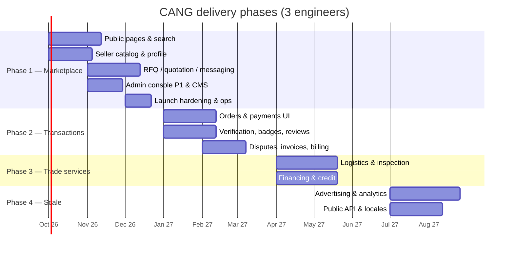

# 09 — Roadmap

Four phases, cumulative. Effort is in **person-weeks (pw)** for a senior full-stack engineer familiar with the
stack, excluding design and content; a team of three works roughly in parallel on independent epics, so
calendar time is about 45 % of the pw total per phase. Dependencies name the epic id that must be done
first. Status reflects [`07-mvp-boundaries.md`](07-mvp-boundaries.md).

Dates are indicative; the phase gates (§5) decide when the next phase starts.

---

## 1. Phase 1 — Marketplace (foundation ≈ 40 % done)

Goal: a buyer finds a supplier, posts an RFQ, compares quotations and negotiates; a supplier presents a
factory and answers; operators moderate. No money moves.

| Epic | Tasks | Depends on | Effort | Status |
|---|---|---|---|---|
| **E1.1 Platform core** | Schema, migrations, seeds, auth, RBAC, i18n plumbing, UI kit, layouts, uploads, search service, RFQ/orders/payments/fees services, health | — | 8 pw | **Done** |
| **E1.2 Data & i18n completion** | Full demo dataset (50 suppliers, 500 products, categories populated, 20 RFQs); 12 missing message namespaces in `en`/`vi`; unaccent migration for search vectors (L-06) | E1.1 | 2.5 pw | To do |
| **E1.3 Public discovery** | Homepage sections; `/products`, category pages with facets; `/product/[slug]`; `/manufacturers` × industry × province; `/supplier/[slug]`; `/clusters`; `/search` + suggest; `sitemap.ts`; JSON-LD on every entity page | E1.2 | 5 pw | To do |
| **E1.4 Seller catalogue & profile** | `/seller/company`, `/factory`, `/certifications`; product CRUD with images/tiers/variants/specs; publish flow with moderation setting and plan limit; profile completeness | E1.1 | 4 pw | To do |
| **E1.5 RFQ & quotation** | `createRfq` action + form; `/buyer/rfqs/*` incl. compare; public `/rfq`, `/rfq/[id]` with masking, `/rfq/new` gate; `/seller/rfqs/*`; quotation create/revise/withdraw; `rfq-expire` job | E1.1, E1.4 | 4 pw | To do (services done) |
| **E1.6 Messaging** | `modules/messaging` service (conversations, participants, messages, counter-offer payload, attachments); buyer/seller pages; unread counts; `MESSAGE_NEW` | E1.1 | 3 pw | To do |
| **E1.7 Accounts & team** | Saved items; `/team` invitations and roles; `/settings` (profile, password, locale, sessions list); `/notifications` page; `/documents` library | E1.1 | 2.5 pw | To do |
| **E1.8 Admin console P1** | `/admin/users`, `/companies`, `/products` moderation, `/categories`, `/rfqs`, `/cms` (pages, banners, homepage sections), `/settings`, `/audit`; `/admin` overview counters | E1.1 | 4 pw | To do (shell done) |
| **E1.9 Content & legal** | Guides (≥ 6), why-vietnam, pricing, about, contact → tickets, help, legal pages (terms, privacy, cookies, AUP) in both locales; CMS markdown renderer with sanitisation | E1.8 | 1.5 pw + content | To do |
| **E1.10 Launch hardening** | SMTP/Resend provider; `S3Storage`; `session-gc` job; Redis rate-limit store; CSP; Sentry; e2e suite (register → product → RFQ → quote → compare → message); Lighthouse ≥ 95 SEO; load test search at 50 k products | E1.3–E1.8 | 3 pw | To do |
| **E1.11 Deployment** | Sprintbox VPS, Compose, Caddy TLS, DNS at iNET, backups, restore drill, `SEED_DEMO_DATA` guard, staging environment | E1.1 | 1 pw | Files done; provisioning to do |
| | | **Total remaining** | **≈ 30.5 pw** (≈ 10–12 weeks with 3 engineers) | |

**Milestones.** M1.1 public site browsable with seeded catalogue (E1.2, E1.3). M1.2 supplier self-service
(E1.4). M1.3 end-to-end RFQ → quotation → message (E1.5, E1.6). M1.4 admin can moderate and configure
(E1.8). **M1.5 Public launch** (E1.9–E1.11, gate §5).

---

## 2. Phase 2 — Transactions (foundation ≈ 30 % done)

Goal: an accepted quotation becomes an order, funds move through a licensed partner under Trade Assurance,
disputes are mediated, suppliers are verified and reviewed; CANG earns commission.

| Epic | Tasks | Depends on | Effort | Status |
|---|---|---|---|---|
| **E2.1 Escrow partner** | Contract with the partner bank; `PARTNER_BANK_TA` real account details; first real `PaymentProviderAdapter` (virtual accounts or API) with `parseWebhook`; `/api/webhooks/payments/[provider]`; idempotency on `providerReference` | partner signed | 3 pw | To do |
| **E2.2 Orders UI** | Accept-quotation action → `createOrderFromQuotation`; `/buyer|seller/orders`, `/[id]` with timeline, documents, status actions per `TRANSITION_ACTORS`; shipping address capture; `/admin/orders` with forced transitions; `/admin/order-statuses` lifecycle editor | E1.5 | 4 pw | To do (service done) |
| **E2.3 Payments UI** | `/buyer/payments` with transfer instructions from `initiatePayment`; `/seller/payments` escrow state; `/admin/payments` confirm/release/refund (FINANCE); fee preview on quotation accept; `order-auto-complete` job; commission double-record guard (L-14) | E2.1, E2.2 | 3 pw | To do (service done) |
| **E2.4 Invoices & commission billing** | Proforma/commercial invoice PDF; platform commission invoices monthly (`commission-invoice` job); `/admin/fees`, `/admin/fees/commissions`; `/buyer|seller/invoices` | E2.3 | 3 pw | To do |
| **E2.5 Disputes** | `modules/disputes`: open within window, respond, escalate, mediation queue (`admin.disputes.resolve`), resolution → refund/release via payments service, escrow freeze gate, internal notes | E2.3 | 3 pw | To do |
| **E2.6 Verification & compliance** | KYB submission forms + documents (`visibility = ADMIN`); `/admin/verification` queue; UBO forms; sanctions screening adapter (`compliance_checks`); `verification-expire` job; `/admin/compliance`, `/admin/risk` | E1.8 | 4 pw | To do |
| **E2.7 Badge engine** | Nightly job with a handler per `ruleConfig.type`; manual grant UI in `/admin/companies/[id]`; response-rate metrics from messaging | E1.6, E2.6 | 1.5 pw | To do |
| **E2.8 Reviews & anti-fraud** | `modules/reviews`: submit after `COMPLETED`, five dimensions, fraud signals, auto-publish threshold, reply, moderation queue in `/admin/moderation`, rating aggregation | E2.2 | 2.5 pw | To do |
| **E2.9 Subscriptions & billing** | Plan upgrade flow, plan payment through the payments service, limit enforcement helpers (`maxProducts`, `maxRfqResponsesPerMonth`, seats), `/seller/subscription`, `/admin/plans`, `VERIFICATION_FEE` charge | E2.3 | 3 pw | To do |
| **E2.10 Security P2** | TOTP 2FA (mandatory for staff), counterparty document resolution in `/api/files` (L-10), sessions page with revoke, `/admin/support` | E1.7 | 2 pw | To do |
| **E2.11 Providers admin** | `/admin/providers` for payment/financing/logistics/inspection rows (activation, `publicConfig`, licence info) | E1.8 | 1 pw | To do |
| | | **Total** | **≈ 30 pw** (≈ 12 weeks) | |

**Milestones.** M2.1 first order created from a quotation in staging. M2.2 first real deposit held by the
partner bank (sandbox). M2.3 dispute resolved with partial refund end-to-end. M2.4 first `VERIFIED_MANUFACTURER`
badge granted by the engine. **M2.5 Transactions live** (gate §5).

---

## 3. Phase 3 — Trade services (foundation ≈ 20 % done)

Goal: logistics, inspection and financing bookable from an order; each adds a revenue stream.

| Epic | Tasks | Depends on | Effort | Status |
|---|---|---|---|---|
| **E3.1 Logistics** | `modules/logistics`: request from order or standalone, provider matching by services/modes/countries, quotes, accept → `LOGISTICS_COMMISSION`, shipment creation, milestones (manual entry + webhook `/api/webhooks/logistics/[provider]`), `/buyer|seller/shipments`, `/admin/logistics`, `LogisticsProvider` adapter for one forwarder API | E2.2 | 5 pw | To do |
| **E3.2 Inspection** | `modules/inspection`: request, agency quotes, schedule, checklist, report upload (`INSPECTION_REPORT`), result → order transition rules, `INSPECTION_COMMISSION`, `/buyer/inspections`, `FACTORY_AUDITED` badge input | E2.2 | 3 pw | To do |
| **E3.3 Credit scoring** | `modules/credit`: feature extraction, bucket/map evaluation of `credit_scoring_rules`, versioned snapshots, `credit-score` job, admin view | E2.2, E2.8 | 2 pw | To do |
| **E3.4 Financing marketplace** | `modules/financing`: application forms (seller/buyer products), documents, routing engine over `routingRules`, `FinancingProvider` adapter (manual + one API lender), offers, acceptance, funded/repaid states, `FINANCING_ORIGINATION`, `/buyer|seller/financing`, `/admin/financing`, `/api/webhooks/financing/[provider]` | E3.3, lender signed | 5 pw | To do |
| **E3.5 Service pages** | `/logistics`, `/inspection`, `/financing` public pages fed by provider tables; Trade Assurance page | E1.9 | 1 pw | To do |
| **E3.6 Compliance P3** | Transaction-monitoring rules writing `risk_flags`; release freeze on `HIGH`/`CRITICAL`; periodic re-screening job; AML evidence export | E2.6 | 2 pw | To do |
| | | **Total** | **≈ 18 pw** (≈ 8 weeks) | |

**Milestones.** M3.1 shipment tracked to `DELIVERED` from a forwarder webhook. M3.2 inspection report gates
`QUALITY_INSPECTION → SHIPPING`. M3.3 first financing offer accepted and funded. **M3.4 Trade services live.**

---

## 4. Phase 4 — Scale (foundation ≈ 15 % done)

| Epic | Tasks | Depends on | Effort | Status |
|---|---|---|---|---|
| **E4.1 Advertising** | Campaign purchase (`ad_products` pricing models), creative approval in `/admin/advertising`, placement rendering (featured product/supplier, top search, category, homepage, RFQ boost), `ad_events` capture with cost, `ad-budget` job, `/seller/advertising` funnel | E2.9 | 5 pw | To do |
| **E4.2 Analytics** | `analytics_events` capture (page/search/product/supplier views, RFQ, order), `metrics-rollup` job into `supplier_daily_metrics`, `/seller/analytics` (plan-gated), `/admin/analytics` (GMV, conversion, revenue by stream) | E2.3 | 4 pw | To do |
| **E4.3 Public API** | API key issuance (`company.apikeys.manage`, plan/fee gate), `/api/v1` products, RFQs, quotations, orders, shipments; scopes; rate limit per key; outbound webhooks; OpenAPI spec; `/seller/api` | E2.2, E3.1 | 4 pw | To do |
| **E4.4 Search at scale** | `search_outbox`, indexer worker, `OpenSearchProvider`, facet aggregations, synonyms, typo tolerance; reindex tooling | E1.3 | 3 pw | When catalogue > ~200 k products |
| **E4.5 Locales** | `zh`, `ko`, `ja` first (buyer markets), then `ru`, `th`, `id`; message files; `*_translations` tables or extended in-row columns; message translation provider for chat | E1.2 | 2 pw per locale + translation | To do |
| **E4.6 Platform ops** | Worker tier (queue consumers, scheduler), Redis cache handler, read replica wiring, managed Postgres migration, Kubernetes manifests if multi-region | E1.10 | 4 pw | As scaling demands |
| **E4.7 Notification templates** | `email_templates` rendering per locale in `notifyUser`, digest e-mails, notification preferences per user | E1.7 | 1.5 pw | To do |
| | | **Total** | **≈ 24 pw + locales** | |

---

## 5. Phase gates

| Gate | Criteria to proceed |
|---|---|
| **Launch P1** | Phase 1 exit criteria ([`07-mvp-boundaries.md`](07-mvp-boundaries.md) §1.2); legal pages published; privacy notice and PDPD consent flows live ([`10-security-compliance.md`](10-security-compliance.md) §6); backups restored once successfully; ≥ 30 real suppliers onboarded |
| **Start P2 money flows** | Signed escrow/partner-bank agreement with sandbox; FINANCE and COMPLIANCE staff roles staffed; 2FA for staff; dispute policy and Trade Assurance terms reviewed by counsel |
| **Start P3** | ≥ 20 completed orders; at least one forwarder, one inspection agency and one lender contracted with API or manual SLA |
| **Start P4** | Monthly GMV and traffic justify ad inventory; API demand from ≥ 3 suppliers/buyers; catalogue size or relevance complaints justify OpenSearch |

---

## 6. First 30 days after launch — operations checklist

### Week 1 — stability

- [ ] Uptime monitor on `https://cang.vn/api/health` (1-min interval, alert to on-call)
- [ ] Verify nightly `deploy/backup.sh` ran; perform the first restore into staging
- [ ] Review Caddy access logs and app logs daily for 5xx, `[action] unexpected error`, `[audit] failed`
- [ ] Confirm SPF/DKIM/DMARC pass on transactional e-mail (mail-tester), DMARC reports arriving
- [ ] Search Console: submit `sitemap.xml`, check coverage and hreflang errors
- [ ] Rotate `SEED_ADMIN_PASSWORD`, delete demo accounts, confirm `robots.txt` blocks dashboards

### Weeks 1–2 — partner onboarding

| Partner | Actions | Owner |
|---|---|---|
| **Bank / escrow partner** (Phase 2 prerequisite) | Shortlist 2–3 licensed Vietnamese banks or licensed payment intermediaries with segregated-account products; NDA; requirements doc (virtual accounts per payment, webhook on credit, release/refund API or manual SLA); sandbox access; legal review of the Trade Assurance terms | CEO + Finance |
| **Lenders** | Introduce the routing model (`financing_providers.routingRules`, credit-score snapshot); agree data-sharing consent language; pick one bank and one factoring company for pilot | CEO |
| **Forwarders** | Onboard 3–5 forwarders (HCMC, Hai Phong, air); agree quote SLA (24 h), milestone reporting method (API/e-mail/manual), commission (`LOGISTICS_COMMISSION` 5 %) | Ops |
| **Inspection agencies** | Onboard 2 agencies; report template → `inspection_orders.checklist`; commission (`INSPECTION_COMMISSION` 10 %); factory-audit product for the `FACTORY_AUDITED` badge | Ops |
| **Verification data sources** | Access to the National Business Registration Portal lookups; sanctions screening vendor trial (for `compliance_checks.provider`) | Compliance |

### Weeks 2–3 — legal and compliance

- [ ] Terms of service, privacy policy (GDPR + PDPD), cookie policy, Trade Assurance terms, supplier agreement,
      buyer agreement published under `/legal/*` in `en` and `vi`
- [ ] Data-processing records and PDPD impact assessment drafted ([`10-security-compliance.md`](10-security-compliance.md) §6)
- [ ] E-commerce platform notification/registration with the Ministry of Industry and Trade (Bộ Công Thương)
      as required for marketplace operators in Vietnam — confirm scope with counsel
- [ ] DPO / data-protection contact named and published; `dmarc@`, `security@`, `privacy@` mailboxes live
- [ ] Incident response contacts and severity matrix agreed (§ [`10-security-compliance.md`](10-security-compliance.md) §7)

### Weeks 2–4 — supply-side content

- [ ] Recruit the first 30–50 real manufacturers across the 8 clusters; white-glove profile setup
      (`/seller/company/factory`, certifications, ≥ 10 products each)
- [ ] Manual verification of the first cohort so `VERIFIED_MANUFACTURER` appears on launch pages
- [ ] Photography/video guidelines for factory media; translation help for `nameVi`/`descriptionVi`
- [ ] Six guides live (importing from Vietnam, Incoterms for first-time buyers, QC basics, Trade Assurance
      explained, how to write an RFQ, choosing a forwarder) in both locales

### Weeks 1–4 — SEO and demand

- [ ] Verify indexation of category, industry × province and cluster pages; fix thin pages with `noindex, follow`
- [ ] Core Web Vitals on product/supplier pages (LCP < 2.5 s, CLS < 0.1)
- [ ] Structured-data validation (Product, Organization, BreadcrumbList) in Search Console
- [ ] Backlink outreach: trade associations (VITAS, LEFASO, HAWA), cluster industrial-zone authorities
- [ ] Seed 20 public RFQs from early buyers so `/rfq` is not empty; measure RFQ → quotation time
- [ ] Weekly KPI review: signups by side, profile completeness, RFQs posted, quotations per RFQ, time to first
      quotation, messages, search zero-result rate (from logs until analytics land)

### Day 30 review

- [ ] Decide Phase 2 start against the gate in §5
- [ ] Re-estimate E2.1 based on the chosen partner's integration model
- [ ] Update this roadmap and [`07-mvp-boundaries.md`](07-mvp-boundaries.md) with what actually shipped
