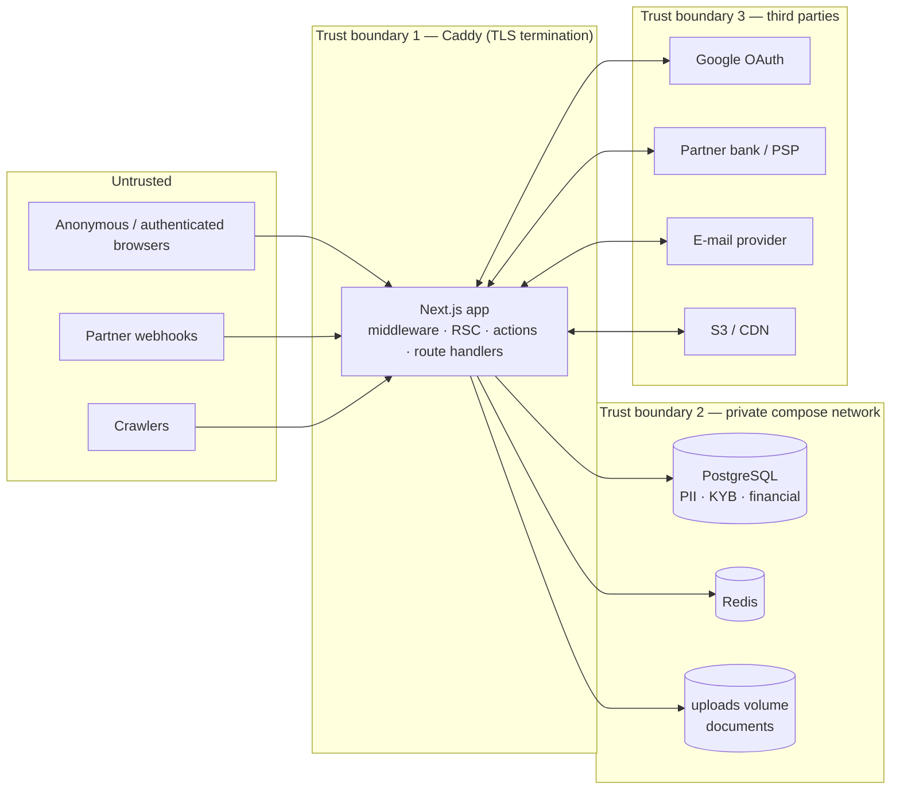

# 10 — Security & Compliance

CANG holds three kinds of sensitive data — personal data of users in Vietnam and abroad, KYB evidence about
companies and their beneficial owners, and financial records of trades — and it orchestrates money it never
holds. This document is the threat model, the control inventory, the data-handling rules and the incident
process. Control implementation details live in [`06-system-architecture.md`](06-system-architecture.md) §9
and [`05-permissions.md`](05-permissions.md).

---

## 1. Assets and trust boundaries

| Asset | Classification (§4) | Where |
|---|---|---|
| Session tokens, password hashes, 2FA secrets | Secret | `sessions.tokenHash`, `users.passwordHash`, `users.twoFactorSecret` |
| User identity (name, e-mail, phone, IP, locale) | PII | `users`, `sessions.ipAddress`, `audit_logs.ipAddress` |
| Company registration, licences, tax IDs, bank details | KYB / Confidential | `companies`, `verifications.data`, `documents` (`ADMIN`), `payment_providers.publicConfig` |
| Beneficial-owner identity, DOB, nationality, PEP/sanctions status, ID documents | KYB / Special-category PII | `beneficial_owners`, `compliance_checks.result`, `documents` |
| Orders, payments, transactions, commissions, invoices, financing applications and financial data | Financial | `orders`, `payments`, `payment_transactions`, `commissions`, `invoices`, `financing_applications.financialData`, `credit_scores` |
| Trade documents (PO, invoices, B/L, inspection reports, contracts) | Confidential | `documents` (`COUNTERPARTY`) |
| Messages and RFQ content (may include drawings, prices) | Confidential | `messages`, `rfqs`, `quotations`, `documents` (`message` scope) |
| Catalogue, public profiles, CMS | Public | `products`, `companies` (public columns), `pages` |
| Configuration (fee rules, providers, settings) | Internal | `fee_rules`, `*_providers`, `settings` |
| Secrets (`SESSION_SECRET`, DB password, provider keys) | Secret | `.env` on the VPS only |

---

## 2. STRIDE-lite threat model

Each row: threat → what an attacker would do → control(s) → status (**Done** / **Partial** / **Planned**).

### Spoofing

| Threat | Scenario | Controls | Status |
|---|---|---|---|
| Credential stuffing / brute force | Automated logins against `/login` | Rate limit 10 / 15 min per IP+e-mail; bcrypt cost 12; failed attempts audited; generic error | **Done**; 2FA **Planned** (P2), CAPTCHA after N failures **Planned** |
| Session theft | Steal `cang_session` via XSS or network | `httpOnly`, `secure`, `sameSite=lax`; TLS + HSTS; token 256-bit random; stored hashed; 30-day sliding expiry; revoke on reset/suspend | **Done**; sessions page with revoke **Planned** |
| OAuth CSRF / login CSRF | Force a victim to log into the attacker's Google account | `state` in a 10-minute `httpOnly` cookie compared on callback; `email_verified` required | **Done** |
| Account takeover via e-mail collision | Attacker controls a Google account with the victim's e-mail | Linking is by verified e-mail (standard); mitigated by the e-mail provider's own security; optional "confirm link with password" **Planned** | **Partial** |
| Password-reset token guessing | Enumerate reset links | 192-bit token, SHA-256 stored, 1 h expiry, single use; 5 requests / h per IP | **Done** |
| Webhook forgery | Fake a "payment received" callback | `parseWebhook` verifies provider signature/HMAC; idempotency on `providerReference`; no route exists yet | **Planned** (P2) |
| Staff impersonation | Compromised staff laptop | Mandatory TOTP for `platformRole ≠ USER`; short admin session TTL; audit of every admin action | **Planned** (P2) / audit **Done** |

### Tampering

| Threat | Scenario | Controls | Status |
|---|---|---|---|
| Parameter tampering on Server Actions | Change another company's `productId` in a form | Ownership re-check in every service (`eq(x.companyId, company.id)`); ids never trusted; `requireCompany` in actions | **Done** (contract), enforced per feature as built |
| Forbidden order transition | Buyer sets order to `COMPLETED` early to trigger release | `transitionOrder` checks `allowedTransitions` + `TRANSITION_ACTORS` + `isCancellable`; admin bypass audited | **Done** |
| Fee manipulation | Supplier edits commission | Fees computed server-side from `fee_rules` in `confirmPayment`; no client input | **Done** |
| SQL injection | Malicious search string | Drizzle bound parameters, including all `sql\`\`` fragments in the search provider; `toTsQuery` strips tsquery operators | **Done** |
| Malicious upload | Executable disguised as PDF; polyglot image | MIME allow-list, magic-byte sniffing, size cap, random key, `nosniff` on serving, `Content-Disposition: inline` with encoded name | **Done**; antivirus **Planned** |
| Stored XSS | Script in product description or message | React escaping; no `dangerouslySetInnerHTML` except JSON-LD; e-mail bodies escaped; CMS markdown sanitised (`rehype-sanitize`) when the renderer lands | **Done** / CMS **Planned**; CSP **Planned** |
| Migration tampering | Altered SQL in `drizzle/` | Reviewable SQL in git; migrations run only from the image built from a tagged commit | **Done** (process) |
| Audit-log tampering | Staff edits history | Append-only by application code; `audit()` never updates; DB role for the app should lack `DELETE` on `audit_logs` | **Partial** — DB-level grant **Planned** |

### Repudiation

| Threat | Scenario | Controls | Status |
|---|---|---|---|
| "I never confirmed that payment" | Finance disputes an action | `audit_logs` with actor, IP, UA, `before`/`after`; `payment_transactions` with `rawResponse` evidence; `order_events` timeline | **Done** |
| Party denies a message or quotation | Commercial dispute | Immutable `messages`, `quotations` revisions (`parentQuotationId`), `documents.checksum` | **Done** (schema) |
| Lost logs | Container restart | Docker json-file rotation; ship to a log service | **Partial** — shipping **Planned** |

### Information disclosure

| Threat | Scenario | Controls | Status |
|---|---|---|---|
| Private document fetched by URL | Guess `/api/files/<key>` | Visibility check per `documents` row; 96-bit random keys; `no-store` for non-public | **Done**; counterparty resolution **Planned** (L-10) |
| Buyer identity leak on public RFQs | Supplier scrapes buyers | Masking until the supplier has quoted; `noindex` on parameterised pages | **Planned** with the page (P1) |
| Cross-company data in queries | Missing `companyId` filter | Convention + code review; integration tests per module | **Partial** — tests **Planned** |
| Secrets in client bundle | `env()` imported in a client component | `server-only` import guard on `env.ts`; only `NEXT_PUBLIC_*` reaches the client | **Done** |
| Error detail leakage | Stack traces to users | `runAction` maps unexpected errors to a generic message; `error.tsx` boundary | **Done** |
| Account enumeration | Register/forgot-password responses | Forgot-password always succeeds; register reveals "already exists" (accepted trade-off for UX; rate-limited 5/h) | **Partial** |
| Backup exposure | Dump on disk or in a bucket | `/var/backups/cang` root-only; bucket private with versioning; **encryption at rest of dumps (age/gpg) Planned** | **Partial** |
| Log PII | E-mails and IPs in stdout | Logs stay on the VPS; structured logger with PII scrubbing **Planned** | **Partial** |

### Denial of service

| Threat | Scenario | Controls | Status |
|---|---|---|---|
| Upload flooding | Fill the disk | 10 MB cap, 60 uploads / h per user, Caddy `max_size 12MB`; disk alerting | **Done** / alert **Planned** |
| Search abuse | Expensive queries | Max 8 tokens, page size ≤ 60, GIN indexes; per-IP limit on `/search` **Planned** | **Partial** |
| RFQ/message spam | Bot accounts | 20 RFQs / h, 60 messages / min; e-mail verification; `rfq.maxOpenPerCompany` setting | **Done** (limits) |
| Connection exhaustion | Many app replicas × pool | `DB_POOL_MAX` sized against `max_connections`; PgBouncer when scaling | **Done** / PgBouncer **Planned** |
| Rate-limit bypass across replicas | Two app containers | Redis `RateLimitStore` | **Planned** (P1 hardening) |
| TLS/ACME abuse | Certificate rate limits | CAA record; Caddy handles renewals | **Done** at deploy |

### Elevation of privilege

| Threat | Scenario | Controls | Status |
|---|---|---|---|
| Member escalates own role | Edit `company_members.role` via team page | `company.members.manage` required; cannot remove last OWNER; role changes audited | **Planned** with the page (P1) |
| `USER` reaches admin console | Direct URL | Layout guard `admin.access` + `requireAdmin(perm)` per page + action | **Done** |
| `COMPLIANCE` executes refunds | Role creep | Matrix separates `admin.disputes.resolve` from `admin.payments.write` | **Done** |
| Settings change by non-super-admin | `admin.settings.write` | Only `SUPER_ADMIN` | **Done** |
| API key exceeds creator | Scope wider than permissions | Scopes must be ⊆ creator's company permissions at issuance | **Planned** (P4) |
| Container breakout | Vulnerable dependency | Non-root `nextjs` user, Alpine base, pinned deps, `pnpm audit` in CI **Planned**, Docker socket never mounted | **Partial** |

---

## 3. Control inventory — implemented vs planned

| Area | Implemented | Planned (phase) |
|---|---|---|
| Identity | bcrypt, DB sessions (hashed, sliding), Google OAuth with `state`, e-mail verification, reset flow, suspension, company switching | TOTP 2FA (P2), OTP/SMS (P2), sessions page (P2), CAPTCHA (P1 hardening) |
| Authorisation | Two-axis RBAC, layout guards, `requireCompany`/`requireAdmin`, UI gating, ownership checks in services, actor rules on order transitions, document visibility | Counterparty document resolution (P2), API scopes (P4), DB-level grants for `audit_logs` (P2) |
| Input & output | zod on every action, `formDataToObject`, React escaping, escaped e-mail HTML, security headers, `nosniff` | CSP with nonces (P2), sanitised markdown renderer (P1) |
| Data | Parameterised SQL, soft delete, immutable snapshots (`tradeAssuranceTerms`, addresses), checksums on documents, typed JSONB | Column-level encryption for `twoFactorSecret` and `financialData` (P2), backup encryption (P1 hardening) |
| Transport & infra | Caddy TLS 1.2+/HSTS, private compose network (DB/Redis unexposed), non-root container, log rotation, health checks, nightly backups with 14-day rotation | Off-host backup encryption, Sentry, structured logs, uptime alerting (P1 hardening); PgBouncer, managed Postgres (scale) |
| Abuse | Rate limits (login, register, reset, OTP, message, RFQ, upload, API), audit trail | Redis-backed limits (P1 hardening), fraud scoring on reviews (P2), transaction monitoring (P3) |
| Compliance | Schema for KYB/KYC/UBO/sanctions/risk flags; settings switches; audit | Workflows and adapters (P2–P3); PDPD/GDPR processes (§6) |

---

## 4. Data classification

| Class | Definition | Examples | Handling rules |
|---|---|---|---|
| **Public** | Intended for anyone, indexed by search engines | Product listings, supplier public profile, cluster pages, CMS | Cacheable; CDN; no auth |
| **Internal** | Operational configuration, not secret but not for users | Fee rules, provider rows, settings, homepage sections, audit metadata | Admin console only; audited edits |
| **Confidential** | Business data of a company or a trade | RFQ details, quotations, messages, orders, trade documents, private notes, analytics | Scoped to owning company (+ counterparty where the domain says so); `COMPANY`/`COUNTERPARTY` visibility; `no-store` |
| **PII** | Identifies a natural person | Name, e-mail, phone, avatar, IP address, user agent, locale, login times | Minimise; access by membership or staff; subject-rights procedures (§6); retention (§5) |
| **KYB / special-category** | Company verification evidence and beneficial-owner data | Business licences, tax certificates, ID documents, DOB, nationality, PEP/sanctions results, bank statements | `ADMIN` visibility; only `COMPLIANCE`/`ADMIN`/`SUPER_ADMIN`; never in logs or e-mails; encrypted at rest (bucket SSE now, column encryption planned); retention driven by AML law (§5) |
| **Financial** | Money movements and credit assessments | Payments, transactions, commissions, invoices, financing applications, credit scores | `FINANCE` role for staff; immutable ledgers (`payment_transactions`, `commissions`); retained per accounting law |
| **Secret** | Grants access | Session tokens, password hashes, 2FA secrets, API key hashes, env secrets | Hashed or encrypted; never logged; rotate on incident |

Cross-border note: buyers are worldwide, suppliers are Vietnamese, the database is in Vietnam (Sprintbox).
EU buyers' PII is therefore transferred to Vietnam — see §6.1.

---

## 5. Retention

Defaults to implement as scheduled jobs and to state in the privacy policy. Legal minimums override deletion
requests for the classes marked *legal hold*.

| Data | Retention | Mechanism | Basis |
|---|---|---|---|
| `sessions` | Deleted at expiry (+0 days) | `session-gc` job | minimisation |
| `verification_tokens` | 7 days after expiry/consumption | `session-gc` job | minimisation |
| Rate-limit buckets | Window length (minutes–hours) | in-memory / Redis TTL | — |
| `audit_logs` | **7 years** (legal hold) | Never deleted by app; exported to cold storage after 12 months | AML/accounting evidence |
| `payments`, `payment_transactions`, `commissions`, `invoices`, `orders` | **10 years** (legal hold) | Never deleted; anonymise counterparties on company erasure | Vietnam Law on Accounting (10 years for accounting documents); GDPR Art. 17(3)(b) |
| KYB `verifications`, `documents` (`ADMIN`), `beneficial_owners`, `compliance_checks` | **5 years after the relationship ends** (legal hold) | Retained even when the company is deleted (no FK from `documents`) | Vietnam AML Law 2022 (5 years); EU AMLD |
| `users` (PII) | Until account deletion request, or 24 months after last login for inactive accounts | Soft delete → anonymise (`email` → hash, `name` → "Deleted user", phone/avatar/IP null) after 30-day grace | GDPR Art. 5(1)(e); PDPD Art. 16 |
| `companies` | Soft delete on request; public profile removed immediately; row anonymised after legal holds lapse | `deletedAt` + anonymisation job | as above |
| `messages`, `rfqs`, `quotations` | 3 years after the last activity on the thread/RFQ, then deleted unless linked to an order (then follows the order) | scheduled job (P2) | commercial-dispute limitation periods |
| `notifications` | 12 months | job | minimisation |
| `analytics_events` | 13 months raw; rollups indefinitely | job | analytics |
| Application logs | 30 days | Docker rotation / log service retention | minimisation |
| Backups | 14 days local, 90 days off-host | `deploy/backup.sh`, bucket lifecycle | recovery |
| Uploads (`storage/uploads`) | Follow the owning `documents` row; orphaned files purged weekly | job (P2) | minimisation |

---

## 6. GDPR and Vietnam PDPD notes

### 6.1 Applicability

- **Vietnam Decree 13/2023/ND-CP (Personal Data Protection Decree, PDPD)** applies: CANG is a Vietnamese
  company processing personal data of Vietnamese and foreign data subjects in Vietnam. Under the Decree CANG is
  a *personal data controller and processor* for user accounts and a *controller* for KYB data.
- **GDPR** applies extraterritorially (Art. 3(2)) because CANG offers services to buyers in the EU (Nordwind
  Outdoor GmbH is the design persona) and monitors their behaviour (analytics). CANG must appoint an EU
  representative (Art. 27) once EU traffic is material.
- Both regimes are implemented by one set of processes; where they differ the stricter rule is followed.

### 6.2 Obligations and where they land in the product

| Obligation | PDPD | GDPR | Implementation |
|---|---|---|---|
| Lawful basis / consent | Consent required for most processing; must be explicit, verifiable, revocable (Art. 11) | Contract (Art. 6(1)(b)) for account/RFQ/order data; legitimate interest for security; consent for marketing/cookies | Registration checkbox (`acceptTerms`, already in the form) recording version + timestamp in `audit_logs` (`auth.register` `after`); separate marketing consent field (P1); cookie banner only if non-essential cookies are added (none today) |
| Privacy notice | Notify data subjects before processing (Art. 13) | Art. 13/14 information | `/legal/privacy` in `en` and `vi`; linked from register, footer and e-mail footer |
| Sensitive personal data | Extra protection; includes financial and biometric data, and "data on origin/ethnicity, political views, health…" (Art. 2(4)) | Art. 9 special categories | UBO nationality/DOB/ID documents and `financialData` are treated as sensitive: `ADMIN` visibility, restricted roles, encryption at rest, access logged |
| Data-subject rights | Access, rectification, deletion, restriction, objection, withdrawal of consent — respond within **72 hours** for some requests (Art. 9–16) | Art. 15–22, one month | `privacy@cang.vn` intake; self-service export (JSON of `users`, memberships, RFQs, messages) and deletion request under `/settings` (P2); anonymisation job honouring legal holds (§5) |
| Cross-border transfer | **Transfer Impact Assessment dossier** filed with the Ministry of Public Security (A05) within 60 days of transfer; annual review (Art. 25) — relevant when EU buyer data leaves Vietnam (e.g. to an EU e-mail provider or S3 region) | Chapter V; SCCs for EU → Vietnam transfers of EU residents' data | Keep primary data in Vietnam; choose e-mail/storage providers with regional endpoints where possible; maintain the TIA dossier and SCCs with sub-processors; list sub-processors in the privacy notice |
| Records / DPIA | Personal Data Processing Impact Assessment dossier filed with A05 within 60 days of starting processing (Art. 24) | Art. 30 records; Art. 35 DPIA for large-scale monitoring | One combined register: purposes, categories, recipients, retention (§5), security (§3), transfers |
| Breach notification | Notify A05 within **72 hours** (Art. 23) | Supervisory authority within 72 h, subjects without undue delay when high risk | Incident process §7 |
| Data protection officer | Designate a department/person responsible for personal data protection | DPO where required (Art. 37) | Named contact published; `COMPLIANCE` role owns the register |
| Children | No processing of children's data without guardian consent | Art. 8 | B2B only; terms require users to be ≥ 18 and act for a business |
| Marketing | Opt-in; unsubscribe | ePrivacy / opt-in | Transactional e-mail only today; marketing lists need consent + unsubscribe link (P2) |

### 6.3 Sub-processors (to be listed in the privacy notice)

Sprintbox (hosting, Vietnam), iNET (domain/DNS), Google (OAuth), the chosen e-mail provider, the chosen object
storage/CDN, Sentry (error tracking, when added), the partner bank (payment data, under its own regulation),
lenders and forwarders (only the data the user submits to them, with consent captured on the application form).

---

## 7. Incident response basics

### 7.1 Severity

| Level | Definition | Examples | Response target |
|---|---|---|---|
| **SEV-1** | Confirmed breach of PII/KYB/financial data, or money-movement integrity at risk, or site down > 30 min | DB dump exfiltrated; forged webhook confirmed a payment; ransomware on the VPS | Acknowledge 15 min, contain 1 h, all-hands |
| **SEV-2** | Suspected breach, privilege escalation, or core flow broken | Admin credentials phished; uploads volume corrupted; login failing | Acknowledge 30 min, contain 4 h |
| **SEV-3** | Vulnerability found, no evidence of exploitation; degraded performance | Dependency CVE; search timeouts | Next business day |

### 7.2 Runbook

1. **Detect** — uptime alert, Sentry, `audit_logs` anomalies (e.g. `auth.login.failed` spikes, `payment.confirm` from unexpected actors), partner report, user report to `security@cang.vn`.
2. **Triage** — on-call assigns severity, opens an incident channel and a timeline document; freeze deploys.
3. **Contain** —
   - Session compromise: rotate `SESSION_SECRET` (`docker compose up -d app`) → all sessions invalid; force password resets for affected users.
   - Staff account compromise: set `users.status = SUSPENDED`, review `audit_logs` by `actorId`.
   - Server compromise: isolate the VPS (Sprintbox firewall), snapshot the disk for forensics, rebuild from the image on a fresh VPS, restore the last clean `pg_dump`, rotate every secret in `.env` and provider credentials.
   - Payment integrity: set `payment_providers.isActive = false` for the affected provider, notify the partner bank, reconcile `payment_transactions` against the bank statement.
   - Data exposure via documents: change the affected `documents.visibility`, rotate storage keys by re-uploading, purge CDN.
4. **Eradicate & recover** — patch, redeploy from a tagged build, verify with `/api/health` and the e2e suite, lift the deploy freeze.
5. **Notify** —
   - A05 (Vietnam MPS) within 72 h of confirming a personal-data breach; the EU supervisory authority within 72 h where EU residents are affected; affected users without undue delay if the risk is high; partner bank per contract.
   - Template: what happened, data categories, number of subjects, measures taken, contact.
6. **Post-mortem** — within 5 business days: timeline, root cause, blameless analysis, actions with owners; update this document and [`09-roadmap.md`](09-roadmap.md).

### 7.3 Preparedness checklist

- [ ] On-call rota and phone tree; `security@`, `privacy@`, `abuse@` mailboxes monitored
- [ ] Secrets inventory with rotation procedure (`SESSION_SECRET`, `POSTGRES_PASSWORD`, provider keys, Google client secret, rclone remote)
- [ ] Quarterly restore drill from off-host backup
- [ ] Access review each quarter: `users.platformRole ≠ USER` list vs. staff list; VPS SSH keys
- [ ] Dependency scan in CI (`pnpm audit`, Docker image scan)
- [ ] Annual review of the PDPD dossiers and the sub-processor list
